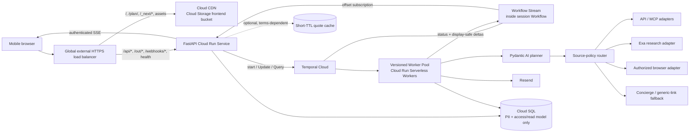

# CPFC Europa away-trip planner — MVP plan

- Status: approved MVP baseline
- Research checked: 3 September 2026 (America/Los_Angeles)
- Primary audience: Crystal Palace supporters planning Europa League away travel
- Sponsor: Temporal, in partnership with Crystal Palace Football Club

## Recommendation in one page

Build a mobile-first, public travel-planning service—not a general chatbot and not a booking site. A supporter completes a short form, a durable planning session researches feasible routes and stays, and the UI renders a structured draft itinerary. The supporter can then ask follow-up questions or request changes in chat. The latest committed itinerary is emailed once when the supporter clicks **Send me my itinerary** or after ten minutes without a meaningful interaction.

The MVP should make seven deliberate choices:

1. Model each user session as one long-lived `TravelPlanningSessionWorkflow`. It owns the request, progress, message queue, itinerary revisions, inactivity deadline, and email state.
2. Keep the planning algorithm evidence-first. Approved sources produce evidence; deterministic code enforces feasibility and calculates comparable totals; the LLM explores and explains. The LLM must never invent a price, schedule, or booking link.
3. Use a provider abstraction and policy-controlled source ladder from day one: official API/MCP/licensed feed → explicitly authorized browser adapter → human concierge in supported launch modes → honestly labeled generic provider link. Pending partner access does not block product development.
4. Use a statically exported Next.js App Router frontend with React and strict TypeScript. Serve it from a Terraform-managed Cloud Storage bucket through Cloud CDN, while FastAPI remains the only dynamic application server.
5. Make live assistant-text streaming an MVP feature. A Pydantic Activity-side event handler publishes display-safe text deltas into Temporal Workflow Streams; FastAPI relays them over authenticated SSE. Two-second snapshot polling is the recovery path, and structured itinerary cards remain atomic.
6. Manage GCP infrastructure with Terraform from the first environment. Terraform owns infrastructure; release tooling publishes immutable API, worker, and frontend artifacts.
7. Keep the domain model club-neutral. Crystal Palace is the only enabled team and the default, but `team_id`, `competition_id`, fixture snapshots, venues, gateways, and itineraries must not contain CPFC-specific assumptions.

The largest product risk is not the LLM or Temporal implementation. It is obtaining reliable live inventory with permission to display, retain, and email the relevant fields. Provider access is a parallel commercialization workstream, not an implementation prerequisite: source rights determine which launch mode and fallback are enabled, not whether the product is built.

## Decisions already made

| Decision | MVP choice |
| --- | --- |
| Fixtures | Crystal Palace's four Europa League away fixtures only |
| User inputs | Departure place, selected fixtures, travellers, travel flexibility, relative budget tier, email, optional extra instructions |
| Booking | Recommendations and outbound booking links only; no payment, reservation, ticketing, or commission requirement |
| Email | One requested itinerary email, even if the user leaves immediately after submission |
| Timeout | Begin inactivity at submission; after ten minutes, finalize only once a valid draft exists |
| Budget | Relative `£ / ££ / £££` preference with plain-language descriptions, not a hard spending cap |
| Branding | Make Temporal sponsorship clear in the page chrome and email |
| Model | `gpt-5.6-terra` with `medium` reasoning for planning and follow-up turns initially |
| Trip grouping | One independent round trip per fixture; combined multi-fixture trips are post-MVP |
| Frontend | Next.js App Router, React, strict TypeScript, and `output: "export"`; no production Node.js server |
| Streaming | Display-safe assistant text through Temporal Workflow Streams → FastAPI SSE; atomic itinerary commits; two-second snapshot fallback |
| Source fallback | API/MCP/feed first, authorized browser second, supported human concierge third, generic provider link last; no evasion |
| Quote policy | Exact price/availability enters each storage or delivery channel only when the active source policy permits it |
| Backend | Python FastAPI JSON API, full type hints, Pydantic AI, Temporal Cloud, Cloud SQL PostgreSQL |
| Deployment | Terraform-managed global HTTPS load balancer; Cloud CDN/Cloud Storage frontend; FastAPI Cloud Run backend; Temporal Serverless Workers on a Cloud Run Worker Pool |
| Infrastructure as code | Terraform from day one, with pinned providers and a committed dependency lock file |
| Local development | `uv`; pinned Node.js and frontend lockfile; Docker Compose for PostgreSQL; Temporal CLI dev server |
| Email provider | Resend |

## MVP scope and boundaries

### In scope

- Plan one round trip per selected away fixture.
- Compare direct and less-obvious combinations of flight, rail, coach, ferry, and local transit when data is available.
- Find a stay that is compatible with the match and late-night transport, not merely the cheapest room in the city.
- Render a primary recommendation plus a small number of meaningful alternatives.
- Support follow-up questions and itinerary-changing requests.
- Re-check time-sensitive offers before final email generation.
- Produce a readable, responsive email and a mobile-first web experience.
- Preserve source, freshness, uncertainty, and booking-link provenance for every commercial claim.

### Explicitly out of scope

- Buying or holding flights, rail tickets, hotels, match tickets, or anything else.
- CPFC match-ticket eligibility or availability.
- User accounts, passwords, email verification, saved profiles, or marketing email.
- Open-ended destination planning unrelated to the selected fixtures.
- Visa, passport, insurance, medical, or legal advice. The app can link to authoritative guidance.
- Automatically combining separate fixtures into one continuous multi-city holiday. The schema permits it later; MVP plans each fixture independently. Lyon and Beşiktaş are the obvious first combined-trip experiment after launch.
- Price monitoring or later alerts.

## Fixture catalog

The [official CPFC announcement](https://www.cpfc.co.uk/news/announcement/revealed-our-europa-league-league-phase-opponents/) gives these UK-time kickoffs. Local times below are derived from the venue timezone and must be re-verified when the club/UEFA confirms the final venue.

| Fixture ID | Match | Date | UK kickoff | Derived local kickoff | Destination timezone |
| --- | --- | --- | --- | --- | --- |
| `uel-2026-lyon-away` | Lyon v Crystal Palace | Thu 15 Oct 2026 | 17:45 BST | 18:45 | `Europe/Paris` |
| `uel-2026-besiktas-away` | Beşiktaş v Crystal Palace | Thu 22 Oct 2026 | 20:00 BST | 22:00 | `Europe/Istanbul` |
| `uel-2026-jagiellonia-away` | Jagiellonia Białystok v Crystal Palace | Thu 10 Dec 2026 | 17:45 GMT | 18:45 | `Europe/Warsaw` |
| `uel-2026-salzburg-away` | Salzburg v Crystal Palace | Thu 28 Jan 2027 | 20:00 GMT | 21:00 | `Europe/Vienna` |

Do not bury these values in an agent prompt. Store them in a reviewed, versioned fixture catalog with:

- stable team, competition, season, and fixture IDs;
- an aware UTC kickoff instant plus the venue's IANA timezone;
- city and venue as separate records;
- official source URL and `last_verified_at`;
- status such as `provisional`, `confirmed`, `rescheduled`, or `cancelled`; and
- a catalog version copied into each Workflow at start so an in-flight plan remains replay-safe.

For MVP the catalog can be a typed YAML/JSON seed checked into Git. A small importer/admin surface can replace that when other clubs are added.

## User experience

### 1. Home page

The form is the hero. It should feel like a trip brief, not a signup flow.

| Field | Default / behavior | Why |
| --- | --- | --- |
| Team | Hidden or fixed to Crystal Palace for MVP | The model still stores `team_id`; expose a selector when another team is enabled |
| Away matches | Card-style checkboxes; preselect the next upcoming away fixture | Users can choose one or several without knowing opponent IDs |
| Starting from | Search/autocomplete; prefilled `London` and easy to replace | The strongest useful default for this audience; no intrusive location prompt |
| Travellers | `1 adult`; compact stepper; reveal child ages only when needed | Prices and room occupancy depend on party composition |
| Flexibility | `A day either side` | Keep dates simple; advanced controls can set exact earliest departure/latest return per fixture |
| Budget style | `££ Best value` | The default balances time, risk, and total cost |
| Email | Required; syntax-validated only | Used for exactly one transactional itinerary message |
| Extra instructions | Optional textarea | Placeholder: “No overnight coaches, step-free stations, must be home Friday by 18:00, or no shared rooms…” |

Budget copy:

- `£ Keep it cheap` — hostels/simple stays; indirect, overnight, and alternate-airport routes are fair game.
- `££ Best value` — well-rated mid-range or boutique stays; balance total price, journey time, and number of changes.
- `£££ Comfort first` — four/five-star stays where available; favor direct routes, convenient times, and fewer changes.

The tooltip must explain that this preference changes ranking, search radius, flexibility, accommodation class, and acceptable inconvenience. It does not guarantee a price.

Place a short notice immediately under the email field: “We’ll use this address to send this itinerary once. No account and no marketing.” Link to the full privacy notice. The primary CTA can be **Plan my away days**.

### 2. Working state

After FastAPI accepts an idempotent submission, navigate to the fixed, pre-exported `/plan/` route with a non-secret public session ID. The HttpOnly cookie remains the authorization credential. The React page opens an authenticated SSE connection and begins revision-aware snapshot polling as a fallback. A direct reload of `/plan/?session=…` must restore the session without relying on a dynamic Next.js route.

Use a single gray status line and a polite skeleton layout, for example:

- “Checking routes from Manchester…”
- “Comparing nearby airports and rail connections…”
- “Looking for cheaper, less-direct options…”
- “Checking that you can still reach the ground on time…”
- “Building your itinerary…”

These are curated process states, not chain-of-thought. Status events use the same SSE connection as display-safe text deltas. If SSE cannot connect or stalls, the browser polls the authoritative snapshot about every two seconds until streaming recovers. A reload or mobile network change must reconnect without losing progress.

### 3. Draft itinerary

Render each selected fixture as a separate trip. Within a trip, use a chronological day view composed of typed cards:

- transport leg: operator, local departure/arrival, duration, changes, baggage/fare caveats, price, freshness, and booking CTA;
- accommodation: property/room type, nights, distance or journey to venue, cancellation caveat, price, and booking CTA;
- match: opponent, venue, local and UK kickoff, suggested arrival time, and “match ticket not included”;
- local transfer: airport/station/ground connection, operating-hours confidence, and whether cost is live or estimated;
- summary: group total and per-person total, bookable-price coverage, tradeoffs, and recommended booking order; and
- alternatives: at most two that differ materially, such as “cheapest” and “fewer changes.”

Every permitted exact price must say **checked at _time_**, identify whether it is live or estimated, and avoid false precision when taxes, bags, local transit, or exchange rates are missing. When an exact quote is unavailable or cannot be displayed, the card says **Price unavailable—check current fare** and uses an allowed refresh or generic link. Totals are optional and always report their price coverage.

User-facing introductory prose may stream into the response bubble, but partial JSON or typed itinerary output is never rendered. Cards appear only after a `turn_committed` event tells the client to fetch the authoritative, validated snapshot.

### 4. Follow-up conversation

After the first draft, reveal the familiar message composer. Each message is classified into one of two outcomes:

- **Question:** answer in concise rich text without changing the itinerary.
- **Revision:** re-search only affected/stale legs, commit a new structured itinerary revision, explain the change, and rerender the full overview.

Give every turn a stable `turn_id`. Stream provisional, display-safe text into its assistant bubble. If a model Activity retries, a retry event clears text from the failed attempt; after commit, canonical transcript text replaces the provisional buffer and any itinerary revision renders atomically.

Keep one message in flight at a time on the client. The Workflow may queue a duplicate-safe command, but the UI should not encourage a backlog of contradictory requests. Never stream chain-of-thought, reasoning parts, tool arguments, raw provider data, PII, or partial structured output.

### 5. Finalization and email

Once a draft exists, show a sticky mobile CTA: **Send me my itinerary**. Manual finalization and the inactivity timeout use the same durable code path. Disable chat after finalization is accepted.

The email contains the latest committed plan, its assumptions, the time prices were checked, and clear booking buttons. Because some provider session links expire or may be contractually barred from email, each provider adapter needs a link policy:

- include the direct booking URL only when the provider explicitly permits transactional email use;
- otherwise include a signed **Check latest price / book** link back to the app, which refreshes the search after the user clicks;
- when neither exact quote nor session deeplink may be retained, include a generic official search/booking link and clearly state that it does not preserve the itinerary or price; and
- never include a stale offer as if it were guaranteed.

## Making the budget choice genuinely useful

The core differentiator is total-trip optimization, not finding the lowest headline airfare.

### Candidate generation

For each fixture, deterministically derive a bounded search graph from:

- nearby origin airports and mainline stations;
- destination city airports/stations;
- curated alternate gateways reachable within an acceptable ground-transfer window;
- outbound and return date windows implied by flexibility;
- direct and one/two-change routes;
- rail, coach, ferry, and positioning legs; and
- additional hotel nights introduced by a cheaper route.

The search breadth varies by tier:

| Dimension | `£` | `££` | `£££` |
| --- | --- | --- | --- |
| Date flexibility | widest allowed | default window | narrow/convenient |
| Alternate gateways | broad radius | selective | only clearly convenient |
| Connections | up to two, including self-transfer with warning | normally one | direct preferred |
| Overnight travel | allowed | only when worthwhile | strongly penalized |
| Stay type | hostel/basic | mid-range/boutique | high-end |
| Objective | lowest feasible whole-trip cost | balanced utility | comfort/time/reliability |

Do not ask the LLM to enumerate an unbounded route graph. Code creates and caps candidate searches; the agent can propose a small number of additional gateway hypotheses through a typed tool.

### Feasibility gates

Reject a candidate before ranking if it:

- arrives after the match arrival buffer;
- assumes a station/airport transfer that cannot be completed conservatively;
- depends on local transit that does not run after the match;
- overlaps another leg or uses the wrong timezone/date;
- leaves no realistic check-in or luggage plan;
- violates an explicit user instruction; or
- lacks enough schedule and route evidence to describe as feasible.

Feasibility and live bookability are separate claims. A route can be a useful, well-sourced travel pattern even when the app must ask the user to check the current fare on the provider's site.

Initial conservative defaults:

- arrive in the destination region at least five hours before kickoff, with previous-day arrival preferred for complex/self-transfer routes;
- add provider- and airport-specific connection buffers rather than one global minimum;
- after a late match, require a verified route to the accommodation or label a taxi/ride-hail estimate explicitly; and
- show risky self-transfers as alternatives, not the default, unless the savings are substantial and the user chose `£`.

### Ranking

Calculate rather than narrate the objective. A versioned score should consider:

- full party cost, including extra hotel nights and known local transfers;
- elapsed travel time and time away from home;
- changes, self-transfers, airport changes, and overnight segments;
- price coverage/confidence and offer freshness;
- arrival buffer before kickoff;
- accommodation quality and route to the venue; and
- user constraints.

Record the score components and ranking-policy version in traces. The LLM explains the winner in natural language but cannot overwrite failed feasibility gates or arithmetic.

## Travel data and tool strategy

### Rules

1. Use official APIs/MCP servers, licensed affiliate APIs, and open feeds first; use Exa for contextual research, not as live-fare authority.
2. Use browser automation only under an active allowlisted policy that explicitly permits the domain, action, fields, and launch mode.
3. Use human concierge evidence only in launch modes with operational capacity and permission to display it.
4. Fall back to a generic official search or booking link without claiming a current price or live bookability.
5. Normalize every acquisition path behind typed adapters and record its method, source, retrieval time, and policy version.
6. Revalidate selected offers before display/email when required and permitted; never use one fallback to circumvent a restriction encountered by another.

### Provider assessment

| Provider | Best role | Fit | Material caveat | MVP disposition |
| --- | --- | --- | --- | --- |
| [Kiwi.com official MCP prototype](https://github.com/alpic-ai/kiwi-mcp-server-public) | Flight PoC | Live, curated return/one-way search, ±3 days, direct booking links, no published credential requirement | Prototype; no published production SLA, limits, redistribution, or commercial-use guarantee | Use for the vertical slice; obtain written launch permission or replace |
| [Skyscanner Travel APIs](https://developers.skyscanner.net/docs/intro) | Production flight metasearch; possible hotels | Indicative flexible-date/geography discovery plus Live Prices and booking deep links; strong UK coverage | Partner approval, usage/click-through rules, short-lived sessions, and price changes | Preferred production flight target; apply immediately |
| [Omio B2B](https://www.omio.com/corporate/omio-b2b/) | European rail, coach, ferry, and cross-mode routes | Real-time metasearch, broad operator coverage, routing, redirect checkout | Affiliate/partner onboarding and commercial terms | Preferred ground-transport target; apply immediately |
| [Booking.com first-party MCP](https://developers.booking.com/mcp-server/docs/implementation-guide) / Demand API | Accommodation | AI-oriented structured results, live availability, web URLs/deeplinks, “search/look/redirect” flow | Managed Affiliate onboarding; tools vary per account; caching and email-link rules matter | Preferred stay target if approved |
| [Tictactrip](https://developers.tictactrip.eu/) | Ground fallback | Live European rail/bus inventory and multi-operator combinations | Sales-led and designed through booking/ticket issuance | Evaluate if Omio access or coverage is insufficient |
| [Exa](https://exa.ai/) | Venue access, official advisories, airport/station context, disruption discovery | Excellent clean web research and source discovery | Not authoritative live inventory | Required research toolset |
| Kernel or Browserbase | Authorized JS-only/interaction fallback | Remote browser, recording controls, and typed SDK access | Fragile, terms-sensitive, costlier, and less deterministic than APIs | Implement the adapter in the vertical slice; keep every production domain disabled until its policy is active |
| Duffel | Transactional flight/stay booking | Strong developer API | Optimized for offer-to-order/fulfilment, not third-party deep-link recommendations | Do not use for MVP |
| Amadeus Self-Service | Former easy flight API | Previously attractive | Self-Service portal was decommissioned in July 2026; new access is sales-led | Do not plan around it |

Skyscanner is an especially strong fit for the “magic” because its Indicative API can cheaply explore date and geography combinations before selected candidates are refreshed with Live Prices. Its [Live Prices response](https://developers.skyscanner.net/docs/flights-live-prices/overview) includes bookable itineraries and deep links. Skyscanner's [FAQ](https://developers.skyscanner.net/docs/faqs) also makes clear that access assumes results drive users toward bookings; this product's outbound-link flow is aligned, but approval is not guaranteed.

Booking.com's MCP is the most credible AI-native accommodation option found. It is stateless, bearer-authenticated, affiliate-scoped, and returns `structuredContent`; its live `tools/list` schema is authoritative. The REST tutorial explicitly supports redirecting the traveller to Booking.com instead of taking payment in this app.

Booking.com's current [application-flow rules](https://developers.booking.com/demand/docs/development-guide/application-flows) constrain storage of prices and availability. That is not merely a database concern: returning restricted quote fields from a Temporal Activity would also persist them in Workflow History. The source-policy registry must choose a technically enforceable representation. If an exact quote cannot enter the normal Workflow data path, perform an expressly permitted just-in-time lookup or omit the quote and use an honestly labeled generic link.

Kiwi's MCP is the fastest flight prototype, but it cannot be the silent production dependency until Kiwi confirms commercial use and reliability. Newer AI-native travel MCPs can be benchmarked, but none should outrank a first-party inventory owner without due diligence.

### Source authorization and launch modes

Provider applications and terms review run in parallel with implementation:

1. Kiwi: written production/commercial permission and operating limits.
2. Skyscanner: Travel API application, expected traffic/click-through, permitted caching, and email/link behavior.
3. Omio: Meta Search/affiliate access, exact transport modes/markets, rate limits, and redirect terms.
4. Booking.com: Managed Affiliate access, enabled MCP tools, price/availability retention, and transactional email deeplinks.

For each source, maintain a versioned policy recording permitted fields, storage duration, cache behavior, attribution, launch modes, link/email channels, logs/traces allowed, rate limits, SLA/support, fallback rights, review expiry, owner, and deletion requirements. Public documentation is the conservative starting policy; provider-specific written permission can enable more.

Use four explicit operating modes:

| Launch mode | Automated sources | Human role | User-facing claim |
| --- | --- | --- | --- |
| Public self-serve | Approved API/MCP/feed plus explicitly authorized browser domains | No response-time dependency | Live prices/bookability only where the source policy permits; otherwise generic links |
| Invite-only concierge | The same authorized automation | Club staff or a concierge can fill/verify gaps | Personalized result with the acquisition method and freshness made clear |
| Editorial/social pilot | Official/open data plus human-verified research | Required before publication | Timestamped example fares only where publication is permitted; otherwise route guidance |
| Internal R&D | Mocks, sandboxes, owned pages, and approved sources | Test/QA | No unsupported consumer-facing claim |

Restricting the audience reduces scale and operational exposure; it does not by itself grant permission to automate a site or republish its content. Pending partner access never blocks the provider-neutral Workflow, UI, browser interface, synthetic tests, or a launch mode that can operate honestly with the available sources.

### Browser fallback decision

Implement a provider-neutral browser Activity during the first vertical slice, then run the same authorized test tasks through [Kernel](https://www.kernel.sh/docs/reference/mcp-server) and [Browserbase](https://docs.browserbase.com/platform/browser/getting-started/create-browser-session). Vendor selection is not an implementation blocker. Compare completion rate, extraction accuracy, latency, replay/debug experience, UK/EU processing, recording controls, cost, and policy fit.

Every enabled domain has a versioned `SourcePolicy` with a nested `BrowserAccessPolicy`: allowed hosts/paths/actions, authorization reference and review expiry, launch modes, channel-specific field permissions, quote TTL, concurrency/rate cap, owner, and kill switch. There are no wildcard targets or planner-supplied arbitrary URLs.

Production rules:

- search/read only—no login, reservation, payment, checkout, or acceptance of terms;
- deterministic domain-specific navigation and extraction into typed results;
- stop and downgrade on CAPTCHA, denial, bot block, or unexpected authentication;
- no CAPTCHA solving, stealth mode, fingerprint spoofing, rotating/residential proxies, or access-control/rate-limit circumvention;
- no user email or unrelated PII in the browser session;
- disable browser recording/logging unless the active policy explicitly allows a short-retention diagnostic capture; and
- degrade to concierge where enabled, then to a generic link—never to a fabricated quote.

Browserbase enables CAPTCHA solving by default, so production configuration must explicitly disable it; its own [guidance](https://docs.browserbase.com/platform/identity/captcha-solving) limits solving to authorized workflows. Require equivalent regional-processing, ephemeral-session, and no-recording controls from Kernel. Prefer typed SDK/API Activities over handing an unconstrained browser MCP directly to the planner.

## Proposed architecture



### Components

- **Edge/static hosting:** one global external HTTPS load balancer provides the public hostname. Its default backend is a Cloud CDN-enabled backend bucket containing the static Next.js export; explicit dynamic path rules target the FastAPI serverless NEG. Terraform owns the bucket, CDN/backend bucket, certificate, IP, URL map, forwarding rules, Cloud DNS records when applicable, and IAM.
- **Frontend:** Next.js App Router with React and strict TypeScript, built with `output: "export"` into `out/`. Fixed routes are prerendered; the form, progress reducer, chat, and itinerary cards are focused Client Components. It calls same-origin FastAPI endpoints through `/api/*`, using a generated client/types from FastAPI's OpenAPI schema. There are no production Next Route Handlers, Server Actions, middleware proxy, ISR, runtime SSR, or runtime image optimizer.
- **FastAPI service:** JSON/API only. It validates inputs, manages the Temporal client, sets/validates session cookies, handles Workflow commands and snapshots, bridges Workflow Streams to authenticated SSE, redirects outbound links, and verifies Resend webhooks. It does not render templates or serve the production frontend.
- **Temporal worker:** runs the Entity Workflow, Pydantic agent/model/tool Activities, source-policy router, deterministic verification, email rendering/sending, stream publication, and read-model projection.
- **Cloud SQL:** stores the minimum non-Workflow data: encrypted contact details, opaque public-session-token hash, Workflow ID, final/reconnectable read projection where permitted, email/outbound-link audit records, and deletion timestamps.
- **Optional short-TTL cache:** only if provider terms both require separation from Workflow History and permit transient caching. Use Memorystore/Redis with explicit TTLs; do not add it merely for UI progress.
- **Frontend Cloud Storage bucket:** required and Terraform-managed, with object versioning and Cloud CDN. It contains public exported HTML and hashed `_next/static` assets only. Upload immutable assets first and HTML/release metadata last; retain old hashed chunks for open tabs and rollback.
- **Artifact Cloud Storage bucket:** optional, private, encrypted, and short-retention for oversized diagnostic payloads only. It is separate from the frontend bucket. Raw pages, screenshots, browser recordings, and full provider responses do not belong in Workflow History or the public bucket.

The application has one public HTTPS origin and two backends. Static Next.js output is edge-cached; FastAPI remains the only dynamic runtime, so no Node.js service or production CORS dependency is introduced.

## Temporal design

### Workflow identity and state machine

Use one Entity Workflow per submitted form:

`travel-session/{random_uuid}`

State transitions:

`CREATED → RESEARCHING ↔ AWAITING_CONCIERGE → DRAFT_READY ↔ REVISING → FINALIZING → EMAILED`

`AWAITING_CONCIERGE` is used only in a launch mode with human support and never suspends the ten-minute guarantee: the Workflow commits/emails the latest valid automated or degraded draft at the deadline. Terminal alternatives are `FAILED` or `EMAIL_FAILED`. A partial travel-provider failure should normally produce a degraded, clearly labeled draft rather than fail the Workflow.

The authoritative Workflow state contains:

- immutable `PlanningRequest` and copied `FixtureSnapshot` values;
- a server-selected launch-mode and source-policy-version snapshot;
- phase, safe progress message, and monotonically increasing state revision;
- pending command queue plus bounded message/request deduplication IDs;
- compact conversation history or summary;
- current structured itinerary and revision metadata, subject to provider retention policy;
- active/last-committed turn IDs and Workflow Stream rollover state;
- last meaningful user interaction and email deadline;
- finalization reason (`manual` or `inactivity`); and
- email attempt/status/provider ID.

### Message interface

- `submit_message(command)` — Workflow Update validates size/state, deduplicates, enqueues, resets inactivity, and returns an acceptance receipt.
- `request_finalize(command)` — idempotent Workflow Update records the request and returns quickly.
- `get_snapshot()` — read-only Query returns phase, progress, transcript tail, and current render model.

Update handlers must remain short. They enqueue commands; the main Workflow loop serially runs agent/tool work. This avoids interleaving races and avoids keeping an HTTP request open for the entire agent turn. Before completion or Continue-As-New, wait for all handlers to finish. See Temporal's [message-passing guidance](https://docs.temporal.io/develop/python/workflows/message-passing) and [Entity Workflow pattern](https://docs.temporal.io/design-patterns/entity-workflow).

The initial POST supplies a client-generated submission ID, so a double-tap or mobile retry cannot create two Workflows or two emails.

### Initial planning turn

1. Validate the request and snapshot the fixture catalog.
2. Build bounded route/date/gateway candidates.
3. Route each travel search through the snapshotted launch mode and current source-policy/kill-switch checks; run permitted calls in parallel with explicit rate/concurrency limits.
4. Prefer API/MCP/feed evidence, use Exa for official/contextual gaps, invoke the browser only under an active exact allowlist, and downgrade to concierge/generic links as configured.
5. Normalize and compact results inside Activities.
6. Apply deterministic feasibility gates and compute scores/totals.
7. Ask the planner to choose/explain from the valid evidence and emit a typed `Itinerary`.
8. Run deterministic post-validation; retry/research only the failed portion.
9. Commit revision 1 atomically and set `DRAFT_READY`.

A single Workflow is enough initially. Introduce a child Workflow per fixture only if traces show a real latency or failure-isolation benefit.

### Inactivity timer and exactly-one email

Use Temporal's [Updatable Timer pattern](https://docs.temporal.io/design-patterns/updatable-timer) with deterministic Workflow time.

- Set `last_interaction_at` on submission and every accepted user message.
- Define meaningful interaction as form submission or a submitted message—not page focus, scrolling, or passive reading.
- If ten minutes elapse before the first draft completes, finalize immediately after the first valid draft is committed.
- If a revision is in flight at the deadline, finish it and email the latest committed valid revision; never send half a turn.
- Manual and timeout finalization race through one state transition. The first event that enters `FINALIZING` wins; later requests are no-ops.
- Refresh stale selected offers during finalization when the source policy permits another lookup. A provider change may trigger a bounded repair before rendering the email; otherwise omit the stale quote and use its allowed link policy.
- Send through an idempotent Activity.

Use Resend's [`Idempotency-Key`](https://resend.com/docs/dashboard/emails/idempotency-keys), for example `final-itinerary/{session_id}/{revision}`. Resend retains idempotency keys for 24 hours, so also keep a unique email-delivery record and bound automatic send retries to that window. Treat an ambiguous result after the retry window as an operational exception, not permission to send again. Deduplicate Resend's at-least-once webhook events by `svix-id`.

### Progress delivery

Pydantic AI's ordinary durable streaming methods buffer model events until the model Activity completes. The current integration also supports an Activity-side `TemporalDurability(event_stream_handler=...)` that receives model events live. Bridge that handler to a [Temporal Workflow Stream](https://docs.temporal.io/workflow-streams), then expose the stream to the browser through authenticated SSE.

The session Workflow constructs exactly one `WorkflowStream` in `@workflow.init`, before any Activity can publish. Use typed topics:

- `status` — curated, display-safe phase messages published by Workflow code;
- `text_delta` — user-facing prose from the live Pydantic event handler;
- `retry` — force-flushed boundary identifying a new Activity attempt;
- `turn_committed` — authoritative transcript/itinerary revision pointer after successful validation; and
- `session_closed` — terminal event before a bounded subscriber-acknowledgement wait.

The Activity handler uses `WorkflowStreamClient.from_within_activity()`. Give each segment a stable Temporal Activity ID, `turn_id`, and attempt number. Force-flush the first text delta and retry/commit boundaries; batch ordinary deltas at approximately 200 ms. Never force-flush every token: each batch is delivered through Temporal message-passing and contributes to History.

FastAPI subscribes by global stream offset and forwards that offset as the SSE event ID. On `Last-Event-ID`, it resumes from the next offset. A retry event makes the React reducer discard provisional text from lower attempts of the same segment. After `turn_committed`, the client replaces all provisional text with the canonical snapshot and renders a complete itinerary revision exactly once.

Queries remain the source of truth for initial hydration and recovery. If SSE is unavailable or an offset has been truncated, the client discards provisional state and polls `get_snapshot()` about every two seconds until streaming recovers. Query polling does not claim to stream tokens.

Stream display-safe prose only. Partial itinerary JSON, chain-of-thought/reasoning parts, tool arguments, raw provider responses, and PII are filtered out before publication. Typed itinerary cards change only after deterministic validation and Workflow commit. Plain-text Q&A turns stream directly; initial/revision planning uses curated status plus atomic cards. If user testing shows that every planning turn needs prose deltas, add a narrow text-only presenter pass after the typed plan validates rather than exposing partial structured output.

Workflow Streams are Public Preview, so pin the proven SDK version and make retry, replay, reconnect, Continue-As-New, and history-pressure tests promotion gates. Normal operation uses no Redis. Preserve the same event envelope behind a transport seam so Redis Streams—not lossy Redis Pub/Sub—can replace Workflow Streams if the spike fails its readiness gate.

### History and payload discipline

Pydantic's Temporal integration has a default 2 MB payload boundary, and large histories make replay slower. Therefore:

- never return raw provider pages, full search responses, screenshots, or video into Workflow History;
- normalize inside Activities and return a bounded candidate set;
- separate durable `OfferReference` from time-sensitive `QuoteSnapshot`;
- obey each provider's contract before persisting price/availability in Temporal, Postgres, logs, or Logfire;
- batch streamed prose and truncate committed old-turn deltas according to a tested History budget;
- summarize old chat turns and retain structured user constraints;
- check `is_continue_as_new_suggested()` after a completed turn; and
- if Continue-As-New is needed, use the Workflow Stream rollover helper to carry stream offsets/deduplication alongside application state and the original inactivity deadline, only after message handlers finish.

This is consistent with keeping business process state in Temporal: request, decisions, constraints, revisions, lifecycle, and email state stay in the Workflow; oversized third-party evidence and contract-restricted quotes do not.

## Pydantic AI and model design

### Integration

Use the current capability-based integration documented by [Pydantic AI](https://pydantic.dev/docs/ai/capabilities/durable_execution/temporal/):

- `Agent(..., capabilities=[TemporalDurability(event_stream_handler=publish_agent_events)])` for configurations that produce streamable user-facing text;
- `PydanticAIWorkflow` with stable `__pydantic_ai_agents__`;
- `PydanticAIPlugin()` on worker and FastAPI Temporal clients; and
- `LogfirePlugin()` with explicit PII scrubbing.

Do not use the older `TemporalAgent` wrapper; it is deprecated and planned for removal in Pydantic AI v3. Give the agent and every toolset a stable explicit name/ID because those names become Activity identities and cannot casually change while histories are live.

Disable or minimize nested provider/LLM SDK retries and let Temporal own bounded retry policy. The stream protocol represents Activity retries explicitly so a failed attempt's provisional text cannot survive in the UI. Long model/browser/search Activities need explicit timeouts, heartbeats/checkpoints where useful, and idempotent behavior because Cloud Run scale-in can interrupt them.

### Agent shape

Start with one planner agent, not a network of collaborating agents. A narrow text-only presenter configuration is permitted later if every typed planning turn needs streamable introductory prose; it receives only an already validated plan and cannot change it. The planner's typed tools are narrow:

- `search_flights(search_spec)`;
- `search_ground_transport(search_spec)`;
- `search_stays(search_spec)`;
- `research_context(question, allowed_sources)`;
- `propose_additional_gateway(hypothesis)`;
- `get_fixture(fixture_id)`;
- `calculate_trip_cost(candidate_ids)`; and
- `validate_booking_reference(reference)`.

The orchestration code, not the LLM, decides when searches may run in parallel, caps calls, applies hard feasibility checks, and handles retries. The planner receives only normalized evidence and returns a strict Pydantic model. Web/browser content is untrusted data, never instruction text.

### Model recommendation

The current OpenAI taxonomy is worth correcting before implementation: [GPT-5.6 Luna](https://developers.openai.com/api/docs/models/gpt-5.6-luna) is the cost-sensitive, high-volume tier and roughly corresponds to the older nano tier. [GPT-5.6 Terra](https://developers.openai.com/api/docs/models/gpt-5.6-terra) is the next tier up and balances intelligence and cost. Official [agent-building guidance](https://developers.openai.com/tracks/building-agents#how-to-choose) recommends Terra for conversational interaction and more capable models for complex planning.

Approved MVP default:

- model: `gpt-5.6-terra`;
- reasoning effort: `medium`;
- same model for planning and follow-up turns initially; and
- record model, reasoning effort, prompt version, tool versions, and ranking-policy version on every trace.

This intentionally goes one tier above the initial Luna intuition because multimodal route synthesis and evidence reconciliation are the quality-critical parts of this MVP. After production traces exist, benchmark Luna/lower effort and route simple Q&A or classification to it only when evals show no quality regression.

## Domain model for review

The most important rule is to separate stable domain identity, durable planning decisions, provider references, and volatile quotes.

### Catalog models

```python
class Team(BaseModel):
    id: str
    name: str
    short_name: str
    country_code: str
    brand_key: str
    enabled: bool

class CompetitionSeason(BaseModel):
    id: str
    competition_name: str
    season_label: str

class Place(BaseModel):
    id: str
    name: str
    country_code: str
    latitude: float
    longitude: float
    timezone: str

class Venue(BaseModel):
    id: str
    name: str
    city: Place
    latitude: float
    longitude: float
    status: Literal["provisional", "confirmed"]

class FixtureSnapshot(BaseModel):
    id: str
    competition_season_id: str
    home_team_id: str
    away_team_id: str
    kickoff_at: datetime        # aware UTC instant
    venue: Venue
    status: Literal["provisional", "confirmed", "rescheduled", "cancelled"]
    source_url: HttpUrl
    source_checked_at: datetime
    catalog_version: str
```

`Team` and `CompetitionSeason` make the later club dropdown a catalog/filter change rather than a Workflow rewrite. The Workflow receives `FixtureSnapshot` objects, not IDs that it must look up nondeterministically during replay.

### User request

```python
class TravellerParty(BaseModel):
    adults: int = 1
    child_ages: tuple[int, ...] = ()
    rooms: int = 1

class TravelWindow(BaseModel):
    fixture_id: str
    earliest_departure: datetime
    latest_return: datetime
    arrival_buffer: timedelta

class PlanningRequest(BaseModel):
    team_id: str
    fixture_ids: tuple[str, ...]
    origin: Place
    travellers: TravellerParty
    windows: tuple[TravelWindow, ...]
    budget_tier: Literal["budget", "value", "comfort"]
    extra_instructions: str | None
    locale: str = "en-GB"
    currency: str = "GBP"
    contact_id: UUID            # email itself remains in the PII store
    request_id: UUID

LaunchMode = Literal[
    "public_self_serve",
    "invite_only_concierge",
    "editorial_social",
    "internal_r_and_d",
]

AcquisitionMethod = Literal[
    "api_mcp",
    "authorized_browser",
    "human_concierge",
    "generic_link",
]

class SessionPolicySnapshot(BaseModel):
    launch_mode: LaunchMode
    source_policy_version: str

class BrowserAccessPolicy(BaseModel):
    allowed_hosts: tuple[str, ...]
    allowed_path_prefixes: tuple[str, ...]
    allowed_actions: tuple[Literal["search", "read"], ...]
    max_concurrency: int
    max_requests_per_minute: int
    stop_on_access_challenge: Literal[True] = True
    captcha_solving_enabled: Literal[False] = False

class SourcePolicy(BaseModel):
    id: str
    version: str
    provider: str
    enabled: bool
    acquisition_methods: tuple[AcquisitionMethod, ...]
    launch_modes: tuple[LaunchMode, ...]
    display_fields: tuple[str, ...]
    workflow_history_fields: tuple[str, ...]
    cache_fields: tuple[str, ...]
    email_fields: tuple[str, ...]
    trace_fields: tuple[str, ...]
    quote_ttl: timedelta | None
    booking_link_policies: tuple[
        Literal["direct_web", "refresh_in_app", "generic_search"], ...
    ]
    browser: BrowserAccessPolicy | None
    recording_permitted: bool
    authorization_reference: str
    owner: str
    review_expires_at: datetime
```

The exact email should not be repeated in agent prompts, affiliate parameters, Workflow search attributes, or logs. The Workflow needs a contact reference, and the email Activity resolves it at send time.

The server, not the public form or model, selects `SessionPolicySnapshot`. Browser hosts and actions are exact allowlists inside a general `SourcePolicy`; an expired or disabled policy fails closed. Activities also consult the current kill-switch state, so an emergency disable applies to already-running sessions without changing Workflow determinism.

### Offers and evidence

```python
class Money(BaseModel):
    minor_units: int
    currency: str

class SourceEvidence(BaseModel):
    provider: str
    acquisition_method: AcquisitionMethod
    policy_id: str
    policy_version: str
    source_url: HttpUrl | None
    retrieved_at: datetime
    expires_at: datetime | None
    confidence: Literal["live", "recent", "estimated"]

class OfferReference(BaseModel):
    id: str
    provider: str
    provider_offer_id: str | None
    search_fingerprint: str
    booking_link_policy: Literal["direct_web", "refresh_in_app", "generic_search"]
    evidence: SourceEvidence

class QuoteSnapshot(BaseModel):
    offer_reference_id: str
    total: Money
    per_person: Money | None
    booking_url: HttpUrl | None
    included_items: tuple[str, ...]
    excluded_items: tuple[str, ...]
    observed_at: datetime
    expires_at: datetime | None

class EmbeddedQuote(BaseModel):
    kind: Literal["embedded"] = "embedded"
    snapshot: QuoteSnapshot

class CachedQuote(BaseModel):
    kind: Literal["cached"] = "cached"
    opaque_cache_key: str
    observed_at: datetime
    expires_at: datetime

QuoteHandle = Annotated[
    EmbeddedQuote | CachedQuote,
    Field(discriminator="kind"),
]
```

Approve the policy framework once, then choose each source's concrete representation from its active policy:

- durable storage permitted → `EmbeddedQuote` may enter Workflow History;
- short-lived caching permitted → an Activity writes to an encrypted TTL store and returns only `CachedQuote`;
- display-only use expressly permitted → a just-in-time lookup stays outside Workflow inputs/results, Queries, ranking state, logs, traces, and recordings; or
- no clear permission or enforceable representation → omit the exact quote and provide an honestly labeled generic provider link.

Rendering tolerates an expired/missing quote and shows **Refresh price** or **Price unavailable—check current fare**. There is intentionally no `response_only` value in the persisted union: a normal Activity response is durable Temporal data. Continue-As-New does not immediately erase earlier Workflow histories, and encryption does not turn stored data into non-storage. A human lookup is subject to the same display, retention, and email policy. Redis is selected only if an activated source permits/requires transient quote caching or if it becomes the approved stream contingency.

### Itinerary

```python
class TransportLeg(BaseModel):
    kind: Literal["transport"] = "transport"
    id: str
    mode: Literal["flight", "rail", "coach", "ferry", "local_transit", "taxi", "walk"]
    origin: Place
    destination: Place
    departs_at: datetime
    arrives_at: datetime
    operator: str | None
    service_number: str | None
    offer: OfferReference | None
    quote: QuoteHandle | None
    self_transfer: bool = False
    caveats: tuple[str, ...] = ()

class Stay(BaseModel):
    kind: Literal["stay"] = "stay"
    id: str
    property_name: str
    place: Place
    check_in: date
    check_out: date
    room_description: str | None
    offer: OfferReference | None
    quote: QuoteHandle | None
    venue_transfer_note: str
    caveats: tuple[str, ...] = ()

class MatchEvent(BaseModel):
    kind: Literal["match"] = "match"
    id: str
    fixture: FixtureSnapshot
    recommended_arrival_at: datetime
    ticket_included: Literal[False] = False

ItineraryItem = Annotated[
    TransportLeg | Stay | MatchEvent,
    Field(discriminator="kind"),
]

class TripAlternative(BaseModel):
    id: str
    label: str
    items: tuple[ItineraryItem, ...]
    total: Money | None
    tradeoffs: tuple[str, ...]

class FixtureTrip(BaseModel):
    id: str
    fixture_ids: tuple[str, ...]   # one in MVP; supports combined trips later
    items: tuple[ItineraryItem, ...]
    alternatives: tuple[TripAlternative, ...]
    total: Money | None
    price_coverage: float
    risk_flags: tuple[str, ...]
    summary: str

class Itinerary(BaseModel):
    id: UUID
    revision: int
    request_id: UUID
    trips: tuple[FixtureTrip, ...]
    generated_at: datetime
    ranking_policy_version: str
    assumptions: tuple[str, ...]
    global_caveats: tuple[str, ...]
```

Implementation may use separate discriminated subtypes for each transport mode. The sketch emphasizes invariants:

- all datetimes are timezone-aware;
- every exact price has evidence and freshness;
- booking URLs are never naked strings without provider/link policy;
- alternatives reference a complete feasible trip, not disconnected cheap legs;
- one revision is committed atomically; and
- a future combined trip needs no new top-level shape.

### Workflow command and snapshot models

```python
SessionPhase = Literal[
    "created",
    "researching",
    "draft_ready",
    "revising",
    "awaiting_concierge",
    "finalizing",
    "emailed",
    "failed",
    "email_failed",
]

EmailStatus = Literal["not_requested", "pending", "sent", "failed"]

class ChatTurn(BaseModel):
    role: Literal["user", "assistant"]
    content: str
    created_at: datetime

class SessionCommand(BaseModel):
    id: UUID
    expected_revision: int | None

class UserMessageCommand(SessionCommand):
    text: str

class ConciergeEvidenceCommand(SessionCommand):
    audit_record_id: UUID
    evidence: tuple[SourceEvidence, ...]

class TextDeltaEvent(BaseModel):
    kind: Literal["text_delta"] = "text_delta"
    turn_id: UUID
    segment_id: str
    attempt: int
    text: str

class RetryEvent(BaseModel):
    kind: Literal["retry"] = "retry"
    turn_id: UUID
    segment_id: str
    attempt: int

class StatusEvent(BaseModel):
    kind: Literal["status"] = "status"
    state_revision: int
    message: str

class TurnCommittedEvent(BaseModel):
    kind: Literal["turn_committed"] = "turn_committed"
    turn_id: UUID
    state_revision: int
    assistant_message_id: UUID
    itinerary_revision: int | None

class SessionClosedEvent(BaseModel):
    kind: Literal["session_closed"] = "session_closed"
    state_revision: int

StreamEvent = Annotated[
    TextDeltaEvent | RetryEvent | StatusEvent | TurnCommittedEvent | SessionClosedEvent,
    Field(discriminator="kind"),
]

class SessionSnapshot(BaseModel):
    public_session_id: UUID
    phase: SessionPhase
    state_revision: int
    progress_message: str | None
    itinerary: Itinerary | None
    transcript_tail: tuple[ChatTurn, ...]
    active_turn_id: UUID | None
    last_committed_turn_id: UUID | None
    stream_base_offset: int
    email_deadline: datetime
    finalization_reason: Literal["manual", "inactivity"] | None
    email_status: EmailStatus
```

API models and persisted Workflow models should evolve additively: new fields get defaults; incompatible schema changes require versioning/replay planning.

Command timestamps used for inactivity are recorded with deterministic Workflow time when an Update is accepted; the server does not trust a client-supplied timestamp for the deadline.

The SSE event ID is the Workflow Stream item's global offset, not another application-managed sequence. The React reducer removes lower-attempt deltas matching the same `turn_id + segment_id` when it receives `RetryEvent`. Concierge evidence enters through an authenticated, idempotent Update and references an audit record rather than operator PII. Pending concierge work may improve a draft but can never delay the ten-minute latest-valid-itinerary email or trigger a second email.

## API and session access

Suggested public surface:

- `POST /api/sessions` — validate, persist contact/access row, start Workflow idempotently, set an HttpOnly session cookie, return `202`.
- `GET /api/sessions/{public_id}/snapshot?after_revision=N` — authorize by opaque signed token/cookie and Query Temporal; return the canonical snapshot or `204`/`304` with an ETag when unchanged.
- `GET /api/sessions/{public_id}/events` — required authenticated SSE bridge over Workflow Streams; accept `Last-Event-ID`, subscribe from the next global offset, send heartbeat comments, and hold no authoritative in-memory buffer.
- `POST /api/sessions/{public_id}/messages` — send a duplicate-safe Workflow Update and return an acceptance receipt.
- `POST /api/sessions/{public_id}/finalize` — request finalization.
- `POST /api/internal/sessions/{public_id}/concierge-evidence` — authenticated staff-only, idempotent submission of normalized evidence and an audit-record reference.
- `GET /out/{signed_offer_token}` — enforce provider link policy, record minimal click analytics, refresh if required, then redirect.
- `POST /webhooks/resend` — verify signature and deduplicate events.

Never expose the Temporal Workflow ID as sufficient authorization. Generate a high-entropy public token, store only its hash, use `HttpOnly`, `Secure`, `SameSite=Lax` cookies, and make emailed access links expiring and revocable.

`/plan/` is a fixed exported route; its query-string session ID is an identifier, never an authorization secret. Because the Cloud Storage/CDN backend is the URL-map default, Terraform explicitly routes `/api`, `/api/*`, `/out`, `/out/*`, `/webhooks`, `/webhooks/*`, `/healthz`, and `/readyz` to FastAPI's serverless NEG. API, SSE, redirect, webhook, and health responses are never cached by Cloud CDN.

## Persistence and privacy

The UK ICO's guidance requires a clear notice at collection time, including purposes, recipients, and retention, and stresses [data minimisation](https://ico.org.uk/for-organisations/uk-gdpr-guidance-and-resources/data-protection-principles/a-guide-to-the-data-protection-principles/data-minimisation/) and [storage limitation](https://ico.org.uk/for-organisations/uk-gdpr-guidance-and-resources/data-protection-principles/a-guide-to-the-data-protection-principles/storage-limitation). Product counsel/privacy review should confirm the lawful basis and that the one user-requested itinerary is a service message, not marketing.

Proposed posture, subject to review:

- no marketing language, cross-sell, newsletter signup, or tracking pixel in the itinerary email;
- just-in-time notice beside the email field plus a full privacy page;
- store email encrypted in Cloud SQL and refer to it by `contact_id` elsewhere;
- redact email, free text, and fine-grained trip details from logs and Logfire by default;
- do not send PII in Exa/browser queries or affiliate tracking parameters;
- use a Temporal Payload Codec backed by Cloud KMS if itinerary/preferences in Workflow payloads are in the threat model;
- define and automate short retention for contacts, session projections, browser recordings, provider artifacts, and Workflow History; and
- offer a deletion contact/process before launch.

Do not invent the exact retention period here. Choose it with Temporal Cloud History retention, provider contracts, support needs, analytics, and the privacy review, then display the same policy in the UI.

## Security and abuse controls

- Rate-limit new sessions by IP and normalized email hash; cap concurrently active sessions.
- Add reCAPTCHA Enterprise or equivalent only adaptively when abuse signals warrant it.
- Cap fixtures, message length, agent turns, model requests, provider calls, browser minutes, and total session lifetime.
- Allowlist outbound schemes/domains and sanitize model Markdown/HTML.
- Block SSRF/private-network targets in research and browser tools.
- Keep all provider credentials in Secret Manager with per-runtime service accounts.
- Treat pages and tool outputs as untrusted content; never let retrieved text change system policy or tool permissions.
- Do not log browser cookies, tokens, raw prompts with email, or full provider payloads.
- Verify Resend webhook signatures and deduplicate deliveries.
- Authenticate SSE exactly like snapshot requests and reject stream events containing reasoning, tool arguments, provider payloads, or PII.
- Attach Cloud Armor/rate-limit policy to the FastAPI backend service behind the global HTTPS load balancer. Static and API routes share a hostname, but session/API responses are never CDN-cached.

## Accessibility, performance, and brand

- Target WCAG 2.2 AA, including focus order, labels/errors, keyboard use, reduced motion, touch targets, and a screen-reader live region for status.
- Never rely on CPFC red/blue or gray alone to communicate state.
- Prerender useful fixed-route HTML at build time, minimize Client Component boundaries and shipped JavaScript, reserve card space to prevent layout shift, and test the production export on throttled mid-range mobile hardware.
- Set and enforce p75 mobile targets of LCP ≤2.5 s, INP ≤200 ms, and CLS ≤0.1, plus a measured initial-JavaScript budget in CI.
- Route-split planner/chat code, build responsive AVIF/WebP assets at build time, and do not depend on the runtime Next.js image optimizer.
- Serve `/_next/static/*` with `public, max-age=31536000, immutable`; serve HTML and release metadata with `no-cache` or `no-store`, and retain previous hashed chunks through rollout and rollback.
- Show local time prominently and UK time secondarily; use 24-hour `en-GB` formatting and GBP by default.
- Use approved CPFC/Temporal marks only after brand review.
- Suggested persistent attribution: “Built by Temporal in partnership with Crystal Palace.”
- Persistent disclaimer: “Travel recommendations only. Prices and availability change. Match tickets are not included.”

## Observability and evaluation

### Logfire

Use `LogfirePlugin()` so Temporal Workflow/Activity telemetry and Pydantic AI model/tool spans form one trace. Instrument FastAPI and provider HTTP clients, but configure scrubbing before sending production traffic. Trace IDs should correlate session, Workflow, provider calls, and email without using email as an attribute. Measure stream timing, batch sizes, attempts, and offsets without recording delta text as telemetry attributes.

### Pydantic Evals

Pydantic's [agentic evaluators](https://pydantic.dev/docs/ai/evals/evaluators/agentic/) can check tool coverage, arguments, trajectory, and request budgets from Logfire spans. Start with a code-owned golden dataset and view experiments in Logfire.

Representative cases:

- London, Croydon, Brighton, Manchester, and Glasgow origins;
- each fixture and each budget tier;
- one adult, a pair, a family, and two rooms;
- no overnight travel, step-free needs, private room only, and fixed return time;
- direct routes sold out, provider partial failure, and price changes at finalization;
- local-transit cutoff after the 22:00 Istanbul kickoff; and
- duplicate submission/message/finalize commands.

Deterministic evaluators:

- schema valid and timezone-aware;
- every exact price has source/freshness/persistence permission;
- no itinerary collision or missed kickoff buffer;
- totals and per-person arithmetic reconcile;
- every default recommendation passes hard feasibility gates;
- source selection followed the active policy and precedence; required source classes were exercised, browser automation ran only against an authorized allowlist, and no fallback attempted evasion;
- maximum model/tool/browser budget respected;
- no PII in trace attributes or affiliate URLs; and
- exactly one final-email transition.

Qualitative evaluators, calibrated against human labels:

- genuinely useful for the selected budget style;
- explains tradeoffs without overwhelming the supporter;
- does not overstate price certainty;
- alternatives are meaningfully distinct; and
- revisions follow the latest user request without losing earlier constraints.

Use a stronger or equal judge only after benchmarking the judge itself. Pair LLM judges with deterministic facts; a pleasant but impossible itinerary must fail.

### Product and reliability metrics

- form-to-valid-draft completion rate;
- time to first useful draft, p50/p95;
- percentage of recommended legs with live bookable-price coverage;
- deep-link validity and refresh success;
- whole-trip saving versus the simplest direct baseline for `£` cases;
- user revision rate, manual-finalize rate, and abandonment-before-draft;
- provider failure/fallback/browser-use rates;
- generic-link and concierge-intervention rates, segmented by launch mode and acquisition method;
- handler-to-browser first-delta latency, stream batch size/interval, retry epochs, SSE reconnect lag, fallback polling, and offset-gap resync rate;
- streamed Signal/History growth and provisional-to-committed mismatch rate;
- email accepted/delivered/bounced, deduplicated by provider event ID; and
- sampled human feasibility/helpfulness score.

Do not optimize click-through at the expense of trust or sneak marketing into a service email.

## Testing strategy

- **Unit:** timezone/DST conversion, candidate generation, scoring, cost arithmetic, feasibility rules, source precedence/fail-closed policy, link policy, redaction, stream-envelope filtering/serialization, offset parsing, retry reducer, and Pydantic serialization.
- **Frontend:** strict TypeScript, Vitest/React Testing Library, form validation, itinerary rendering, stream/commit reconciliation, duplicate offsets, retry epochs, polling pause/resume, and proof that partial itinerary/tool/reasoning events are rejected.
- **Contract:** recorded/synthetic provider responses, generated OpenAPI client drift, schema changes, deep-link policy, rate limits, expiration behavior, and embedded/cached/omitted quote modes.
- **Workflow:** Temporal time-skipping for inactivity resets, no-interaction email, finalize/timeout race, pending concierge work, in-flight revision, duplicate requests, ambiguous email send, failed stream attempt, successful retry, bounded close acknowledgement, and Workflow Stream state across Continue-As-New.
- **Replay:** representative open/closed histories before every worker promotion.
- **Integration:** real Pydantic handler → local Workflow Stream → FastAPI SSE → client, including proof that a delta arrives before its Activity completes; Postgres, provider sandboxes/mocks, Resend test path, and short-TTL cache if selected.
- **Source policy:** reject arbitrary/non-allowlisted browser targets; downgrade on CAPTCHA/block without evasion; exercise kill switches; verify browser recordings/logs/CAPTCHA solving are disabled; never run automated live tests against an unauthorized consumer site.
- **Reconnect/retry:** resume after offset N without missing/duplicating visible text; clear failed attempt 1 before displaying attempt 2; break SSE and prove two-second Query polling converges to the canonical result.
- **End-to-end:** Playwright on narrow phones, poor network/reconnect, screen reader/keyboard, direct `/plan/?session=…` reload, frontend release during an open session, draft revision, and finalization.
- **Data-policy:** prove forbidden quote fields are absent from Workflow History, database, cache, logs, Logfire, browser artifacts, and email; prove generic links never carry live-price/bookability claims.
- **Chaos:** terminate a Worker during model/search/browser/email Activities and restart FastAPI mid-SSE; verify retry epochs, offset recovery, safe Activity retry, and exactly one canonical itinerary/email.
- **Load/history:** burst traffic after fixture announcements, Cloud CDN cold cache, FastAPI cold start, Worker Pool zero-to-one, provider throttles, Cloud SQL connections, concurrent subscribers, 200 ms stream batching, and per-turn History ceilings.
- **Deployment:** verify URL-map routing/cache headers, API responses never cached, old hashed frontend chunks retained, and frontend rollback without rebuilding.

## Infrastructure and deployment

### GCP topology

- Static frontend: Next.js `out/` in a dedicated versioned Cloud Storage bucket, exposed through a Cloud CDN-enabled backend bucket.
- Dynamic API: FastAPI Cloud Run Service behind a serverless NEG with CDN disabled.
- Edge: global external HTTPS load balancer, reserved global IP, HTTP→HTTPS redirect, Google-managed certificate, DNS records when Cloud DNS is authoritative, and a URL map splitting static and dynamic paths under one hostname.
- Temporal worker: Cloud Run Worker Pool managed by Temporal Serverless Workers/WCI.
- Database: private-IP Cloud SQL for PostgreSQL with IAM authentication.
- Images: API and worker images only in Artifact Registry, deployed by immutable digest; the frontend is a static release artifact, not a runtime image.
- Secrets: Secret Manager; no service-account JSON keys and no secret values in Terraform state.
- Infrastructure: Terraform from day one plus small, purpose-built frontend and Worker release controllers.
- Optional: Memorystore Redis only if an activated quote policy requires TTL caching or Workflow Streams fails its production-readiness gate.

Terraform owns app-resource APIs, service accounts/IAM, frontend and state buckets, CDN/backend bucket, serverless NEG/backend service, URL maps, certificates, IP/forwarding rules, Cloud DNS records when applicable, Cloud Run, Cloud SQL, Artifact Registry, Secret Manager containers, and Worker Pool prerequisites. Terraform does not manage thousands of per-release frontend objects; the publisher uploads a built artifact after infrastructure exists.

Use a separate versioned Cloud Storage bucket for remote Terraform state, bootstrapped by a small Terraform root. Commit `.terraform.lock.hcl`, pin Terraform and provider versions, require reviewed plans, and create no production app resource manually in the console. Production buckets use uniform bucket-level access and `force_destroy = false`.

The frontend publisher:

1. verifies that `out/index.html`, `out/plan/index.html`, and expected `_next/static` objects exist;
2. uploads content-addressed/static assets first with one-year immutable caching;
3. uploads HTML and release metadata last with revalidation/no-store semantics;
4. smoke-tests `/`, `/plan/`, a real hashed chunk, and every dynamic URL-map prefix; and
5. retains the previous release's hashed objects and metadata for rollback/open browser tabs.

Cloud Storage does not provide custom-domain HTTPS by itself; the external Application Load Balancer supplies HTTPS and connects the bucket and FastAPI backends. See Google's [static-site](https://cloud.google.com/storage/docs/hosting-static-website) and [Cloud CDN backend-bucket](https://cloud.google.com/cdn/docs/setting-up-cdn-with-bucket) guidance.

Cloud Run Serverless Workers are currently pre-release and require [Worker Versioning](https://docs.temporal.io/serverless-workers/cloud-run). Use `PINNED` behavior for these short session Workflows. Create one immutable Worker Pool per full-Git-SHA Build ID, attach it to the matching Worker Deployment Version, exercise a real zero-to-one canary, ramp it, and retain old pools until pinned sessions are drained.

### Reuse from `last-minute-odyssey`

Reuse the proven mechanics, not its historical pinned versions or project identity:

- immutable pool/version release orchestration, checkpoints, canary, Current/Ramping promotion, observation, and guarded garbage collection;
- split runner/invoker IAM and exact Temporal Cloud impersonator configuration;
- explicit min/initial/max scaler configuration with read-back validation;
- private-IP Cloud SQL IAM connector, bounded SQLAlchemy pools, migration Job, and readiness probe;
- Cloud Storage object versioning, Cloud CDN/backend-bucket and serverless-NEG URL mapping, managed HTTPS, assets-first/HTML-last publishing, smoke tests, and rollback—adapted from Vite's `dist/assets` layout to Next's `out/_next/static`;
- separate API/worker multi-stage images with pinned `uv`, non-root users, locked installs, and worker `SIGTERM` handling;
- Secret Manager containers in IaC, secret values added outside state; and
- Compose-only PostgreSQL, Temporal CLI dev server with persisted SQLite state, and `uv`-run API/worker processes.

Key local references:

- `/Users/atbaker/Projects/atbaker/last-minute-odyssey/docs/deployment.md`
- `/Users/atbaker/Projects/atbaker/last-minute-odyssey/src/last_minute_odyssey/temporal/orchestration_serverless_release.py`
- `/Users/atbaker/Projects/atbaker/last-minute-odyssey/src/last_minute_odyssey/temporal/serverless_compute.py`
- `/Users/atbaker/Projects/atbaker/last-minute-odyssey/infra/envs/prod/iam.tf`
- `/Users/atbaker/Projects/atbaker/last-minute-odyssey/infra/envs/prod/sql.tf`
- `/Users/atbaker/Projects/atbaker/last-minute-odyssey/infra/envs/prod/storage.tf`
- `/Users/atbaker/Projects/atbaker/last-minute-odyssey/infra/envs/prod/load_balancer.tf`
- `/Users/atbaker/Projects/atbaker/last-minute-odyssey/scripts/infra/publish-frontend.sh`
- `/Users/atbaker/Projects/atbaker/last-minute-odyssey/Dockerfile.api`
- `/Users/atbaker/Projects/atbaker/last-minute-odyssey/Dockerfile.worker`
- `/Users/atbaker/Projects/atbaker/last-minute-odyssey/Dockerfile.frontend`

Do not copy the old Temporal CLI/SDK pins or legacy infrastructure CLI commands/state. Revalidate the pre-release contract against the enabled namespace and pin newly proven versions. Connection validation alone proves read/impersonation, not scale-up permission; the release gate must make WCI actually scale the pool. Configure Next with fixed exported routes and smoke-test `/plan/` directly; a bucket backend must not rely on a generic SPA fallback.

Cloud Run scale-in is not Activity-aware. All Activities are idempotent; long searches/browser runs heartbeat and checkpoint. Keep the interactive API warm and consider a minimum worker instance during high-profile launch windows if zero-to-one latency misses the UX SLO.

### Local and CI

- `uv` lockfile; all Python typed; strict mypy/pyright choice documented; Ruff; pytest.
- Pin Node.js, commit the frontend dependency lockfile, and run strict TypeScript, ESLint, component tests, and `next build` reproducibly.
- Compose runs PostgreSQL only at first. Add Redis only if selected by a quote policy or the streaming contingency.
- Temporal CLI, FastAPI, Worker, and Next development server run as ordinary host processes. Local credentialed CORS is development-only; production-like E2E uses a same-origin proxy over the static export and API.
- CI verifies `out/index.html`, `out/plan/index.html`, expected `_next/static` objects, direct-route behavior, bundle budgets, and generated OpenAPI client drift.
- CI runs `uv lock --check`, Python/frontend checks, unit/integration/workflow/replay tests, image builds, `terraform fmt -check -recursive`, `terraform init -backend=false`, `terraform validate`, Terraform tests, and a reviewed `terraform plan`.
- Production promotion remains manually approved initially; if CI deploys later, use Workload Identity Federation.

## Delivery milestones

### Milestone 0 — parallel source, streaming, and infrastructure spikes

- Submit provider applications while product implementation begins; draft and version the source-policy registry and launch modes, with ambiguous/prohibited sources disabled.
- Query all four destinations from at least five UK origins across every budget tier.
- Validate live/indicative freshness, bookable links, local times, baggage/taxes, hotels, and ground coverage.
- Implement the browser interface and compare Kernel/Browserbase on owned or explicitly authorized test targets; exercise concierge and generic-link fallbacks without touching unauthorized consumer sites.
- Spike Pydantic Activity handler → Workflow Stream → FastAPI SSE, including ~200 ms batching, retry epochs, offset reconnect, Continue-As-New, History growth, and the two-second snapshot fallback. Pin the proven Public Preview SDK.
- Bootstrap Terraform remote state and provider locking, then apply the initial Cloud Storage/CDN/load-balancer/FastAPI edge skeleton without console-created resources.
- Decide each activated source's quote/link/email policy and whether transient quote Redis is required. Trigger the Redis Streams contingency only if the Workflow Streams readiness gate fails.
- Lock official fixture venues, timezones, and travel buffers.

**Exit:** source policies and launch modes are defined, provider applications are in progress, representative mocks/data exist, prohibited sources fail closed, the stream transport passes its retry/reconnect gate or has switched to Redis Streams, and Terraform accounts for the initial GCP topology. Live production rights are not required to start Milestone 1.

### Milestone 1 — one-fixture vertical slice

- London → Lyon, one adult, all three budget tiers.
- Typed fixture/request/offer/itinerary models.
- Source-policy router plus API/MCP, disabled-by-default browser, simulated concierge, and generic-link paths.
- Pydantic AI durable run inside the session Workflow.
- Statically exported Next.js `/` and `/plan/` routes, typed React form/cards/chat, generated API client, curated status, live display-safe text streaming, atomic cards, offset reconnect, retry reset, and two-second snapshot fallback.
- Follow-up revision, direct mobile reload, manual/timeout email, Temporal time-skipping, and Resend idempotency tests.

**Exit:** terminate the Worker during an active model stream and restart the API/browser subscription; the UI removes failed-attempt text, reconnects without stale/duplicate content, commits one valid itinerary, and sends one email.

### Milestone 2 — complete CPFC MVP

- All four fixtures, multiple origins/party shapes, rail/coach/stay adapters, provider degradation.
- Full candidate generation/feasibility/ranking policy.
- Q&A text streaming and stream-safe narration for every applicable turn; typed itinerary revisions remain atomic.
- Transactional email template, signed refresh/generic links, privacy/brand/accessibility copy, and branded static assets.
- Enforced mobile Web Vitals, accessibility, and bundle budgets on the production export.
- Golden eval dataset and baseline experiments in Logfire.

**Exit:** every fixture/tier meets mode-specific feasibility, honesty, freshness, latency, and coverage thresholds; incomplete price coverage is permitted only when the UI says so.

### Milestone 3 — production hardening and launch

- Terraform-managed Cloud Storage/Cloud CDN/global HTTPS/FastAPI Cloud Run/Cloud SQL/Temporal infrastructure, plus separate frontend publisher and Worker release controller.
- Replay, stream-history, CDN cold-cache, URL-map/cache-header, frontend rollback/open-tab, API/Worker cold-start, reconnect, chaos, burst, rate-limit, connection-budget, and mobile E2E tests.
- Security/privacy/terms/brand review and deletion/runbook exercises.
- Select the actual launch mode. Public self-serve requires adequate authorized automated coverage; invite-only or editorial may launch with human/generic-link fallbacks and accurate claims.
- Dashboards, alerts, source kill switches, streaming contingency, and degraded-mode copy.

**Exit:** production canaries prove zero-to-one Worker scaling, each enabled source/fallback transition, kill switches, stream retry/reconnect, itinerary generation, frontend rollback, and exactly-one email.

### Milestone 4 — post-launch expansion

- Convert anonymized, reviewed production failures into eval cases.
- Benchmark Luna/lower effort and cheaper provider strategies.
- Add combined Lyon + Beşiktaş trip planning if useful.
- Add another Europa League club through the generic catalog and expose the team selector.

**Exit:** adding a team requires catalog/branding content and eval cases, not branching business logic.

## MVP acceptance criteria

- A user can submit the defaulted form on a narrow mobile screen in under a minute.
- `/` and `/plan/` ship useful prerendered HTML and meet the agreed p75 mobile Web Vitals and JavaScript budgets.
- A duplicate submission creates one session.
- Every recommended trip is chronologically feasible and arrives with the configured match buffer.
- Exact commercial facts have evidence, timestamp, and permitted booking-link behavior.
- `£` explores materially broader feasible routes and minimizes comparable known whole-trip costs; when coverage is incomplete, it says so and does not claim the cheapest result. `£££` visibly prioritizes convenience.
- Every enabled source has a versioned active policy; unauthorized browser actions fail closed, CAPTCHA/block events cause downgrade without evasion, and a kill switch still produces a safe degraded result.
- Source failure follows the allowed ladder—authorized browser, concierge where enabled, then an honestly labeled generic link—without fabricated price or bookability.
- Exact quotes enter Temporal History, caches, traces, or email only as permitted by the active policy.
- A follow-up revision preserves constraints and atomically updates the structured itinerary.
- A display-safe text delta reaches the browser before its model Activity completes; normal deltas are batched around 200 ms, while only first-delta and retry/commit boundaries force-flush.
- Reload or API restart resumes from the last SSE offset without missing/duplicating visible text; a retried Activity leaves no failed-attempt text in the canonical response.
- Partial structured itineraries never render. Cards change only from one valid Workflow revision to another, at most once per turn.
- If streaming is unavailable, two-second snapshot polling keeps the session usable and converges to canonical state. Normal operation requires no Redis; Redis Streams is the documented contingency.
- No chain-of-thought, reasoning parts, tool arguments, provider payloads, or PII appear in SSE.
- The final email is sent once after manual finalization or ten minutes of meaningful inactivity, even if the browser disappeared.
- Pending concierge work cannot postpone the guaranteed email indefinitely or cause a second delivery.
- Worker termination and API restart do not lose the session.
- A direct `/plan/?session=…` reload restores the Workflow-backed snapshot using a non-secret identifier plus the authorized cookie/link credential.
- Static HTML is non-cacheable, hashed chunks are immutable, dynamic API paths are never CDN-cached, and an open session survives frontend deployment/rollback.
- Production has no Node.js server or CORS dependency; the load balancer routes static and FastAPI paths under one origin.
- A clean reviewed Terraform plan accounts for every production GCP app resource; strict TypeScript, frontend export tests, generated-client drift checks, and Terraform validation pass in CI.
- The interface and email clearly identify Temporal sponsorship and that the app does not sell travel or include match tickets.
- PII is absent from logs, affiliate parameters, and eval datasets by default.
- One additional team can be represented in the catalog/schema without a Workflow or itinerary-model redesign.

## Approved MVP decisions

1. **Model:** start with `gpt-5.6-terra` at medium reasoning and optimize downward only after trace-backed evals.
2. **Trip grouping:** plan one independent round trip per fixture; defer opt-in continuous multi-fixture trips.
3. **Frontend:** use statically exported Next.js App Router, React, and strict TypeScript; FastAPI is the only dynamic server.
4. **Streaming:** use Temporal Workflow Streams Public Preview as an MVP dependency, with pinned versions, authenticated SSE, offset/retry/replay tests, atomic cards, and two-second snapshot fallback. Redis Streams is the pre-agreed contingency only if the readiness gate fails.
5. **Source and launch policy:** build the four-step source ladder and disabled-by-default browser adapter immediately. Source authorization controls activation, while invite-only concierge or editorial modes can launch before public automated coverage is complete. No evasion.
6. **Quote policy:** use a conservative per-source policy registry. Exact price and availability enter Temporal, caches, traces, or email only where the active policy permits; otherwise use an allowed ephemeral path or omit the quote and provide an honestly labeled generic link.
7. **Infrastructure:** use Terraform from the start, including the Cloud Storage/Cloud CDN frontend path, shared HTTPS load balancer, Cloud Run, Cloud SQL, IAM, and Serverless Worker prerequisites. Release objects are published separately from Terraform state.

The initial launch mode—public self-serve, invite-only concierge, or editorial/social pilot—is selected before launch from actual authorized source coverage. That choice does not delay implementation or alter the core data model.

## Primary research sources

- [CPFC fixture announcement](https://www.cpfc.co.uk/news/announcement/revealed-our-europa-league-league-phase-opponents/)
- [Temporal Entity Workflow pattern](https://docs.temporal.io/design-patterns/entity-workflow)
- [Temporal Workflow message passing](https://docs.temporal.io/encyclopedia/workflow-message-passing)
- [Temporal Python message handlers](https://docs.temporal.io/develop/python/workflows/message-passing)
- [Temporal Updatable Timer pattern](https://docs.temporal.io/design-patterns/updatable-timer)
- [Temporal Workflow Streams overview and release status](https://docs.temporal.io/workflow-streams)
- [Temporal Python Workflow Streams](https://docs.temporal.io/develop/python/workflows/workflow-streams)
- [Publishing Workflow Stream events from an Activity](https://docs.temporal.io/develop/python/workflows/workflow-streams#publish-from-a-client)
- [Temporal LLM streaming example](https://docs.temporal.io/develop/python/workflows/workflow-streams#stream-llm-output)
- [Workflow Stream delivery/retry semantics](https://docs.temporal.io/workflow-streams#how-events-are-delivered)
- [Workflow Stream batching/history tuning](https://docs.temporal.io/workflow-streams#tuning)
- [Temporal Serverless Workers on Cloud Run](https://docs.temporal.io/serverless-workers/cloud-run)
- [Temporal Cloud Run deployment guide](https://docs.temporal.io/production-deployment/worker-deployments/serverless-workers/cloud-run)
- [Pydantic AI durable execution with Temporal](https://pydantic.dev/docs/ai/capabilities/durable_execution/temporal/)
- [Pydantic AI Temporal streaming behavior](https://pydantic.dev/docs/ai/capabilities/durable_execution/temporal/#streaming)
- [Pydantic agentic evaluators](https://pydantic.dev/docs/ai/evals/evaluators/agentic/)
- [Pydantic Evals + Logfire](https://pydantic.dev/docs/ai/evals/how-to/logfire-integration/)
- [OpenAI model catalog](https://developers.openai.com/api/docs/models)
- [OpenAI agent-building guidance](https://developers.openai.com/tracks/building-agents#how-to-choose)
- [Next.js production optimization](https://nextjs.org/docs/app/guides/production-checklist)
- [Next.js static exports](https://nextjs.org/docs/app/guides/static-exports)
- [Cloud Storage static-site hosting](https://cloud.google.com/storage/docs/hosting-static-website)
- [Cloud CDN with a backend bucket](https://cloud.google.com/cdn/docs/setting-up-cdn-with-bucket)
- [Global external HTTPS load balancing](https://cloud.google.com/load-balancing/docs/https/ext-https-lb-simple)
- [Terraform Google provider](https://registry.terraform.io/providers/hashicorp/google/latest/docs)
- [Terraform `google_compute_backend_bucket`](https://registry.terraform.io/providers/hashicorp/google/latest/docs/resources/compute_backend_bucket)
- [Kiwi.com MCP announcement](https://media.kiwi.com/company-news/kiwi-com-releases-mcp-server-prototype/)
- [Skyscanner Indicative Prices](https://developers.skyscanner.net/docs/flights-indicative-prices/overview)
- [Skyscanner Live Prices](https://developers.skyscanner.net/docs/flights-live-prices/overview)
- [Omio B2B](https://www.omio.com/corporate/omio-b2b/)
- [Booking.com MCP implementation guide](https://developers.booking.com/mcp-server/docs/implementation-guide)
- [Booking.com accommodation redirect flow](https://developers.booking.com/demand/docs/accommodations/accommodation-tutorial)
- [Booking.com application-flow and quote-storage rules](https://developers.booking.com/demand/docs/development-guide/application-flows)
- [Kernel MCP](https://www.kernel.sh/docs/reference/mcp-server)
- [Browserbase sessions](https://docs.browserbase.com/platform/browser/getting-started/create-browser-session)
- [Browserbase CAPTCHA authorization guidance](https://docs.browserbase.com/platform/identity/captcha-solving)
- [Skyscanner automated-browser blocking guidance](https://help.skyscanner.net/hc/en-gb/articles/201151712-Why-have-I-been-blocked-from-accessing-the-Skyscanner-website)
- [Resend idempotency](https://resend.com/docs/dashboard/emails/idempotency-keys)
- [ICO right to be informed](https://ico.org.uk/for-organisations/uk-gdpr-guidance-and-resources/individual-rights/individual-rights/right-to-be-informed/)
