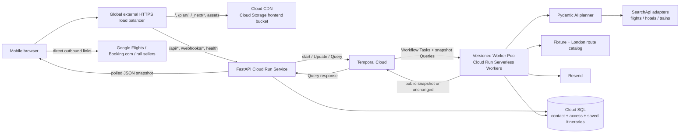

# Eagles Away — MVP plan

- Status: approved rebuild plan; SearchApi selected for flight, hotel, and train results
- Implementation: [local rebuild checkpoint](2026-09-06-implementation-checkpoint.md); public MVP still in progress
- Repository reset: 6 September 2026; initial implementation removed, planning and scripts retained
- Price storage: ordinary durable snapshots in itinerary state; no separate quote cache or expiring handles
- Response delivery: authenticated snapshot polling through direct Temporal Queries; completed messages and atomic itinerary cards; minimum one worker per pool serving active sessions
- Simplification decisions: 6 September 2026; send committed plans unchanged, direct outbound links, SearchApi-only travel acquisition, London route catalog, bounded conversations, and deterministic tests with developer quality review
- Model decision updated: 7 September 2026; Gemini Flash 3.8, low reasoning, Google Cloud EU endpoint
- Provider decision updated: 6 September 2026 (America/Los_Angeles), following live API and Chrome validation
- Original research checked: 3 September 2026 (America/Los_Angeles)
- Primary audience: Crystal Palace supporters planning Europa League away travel
- Sponsor: Temporal, in partnership with Crystal Palace Football Club
- Brand: **Eagles Away**, approved 7 September 2026; **eaglesaway.com** purchased and **notifications.eaglesaway.com** configured in Resend. Palace is the launch audience, with broader Premier League expansion the partnership ambition. Pete can be the Palace-specific guide; club artwork and character treatment remain to be agreed. Multi-club functionality is deferred.

## Recommendation in one page

Build a mobile-first, public travel-planning service for Palace supporters departing from London. A supporter completes a short form, a bounded durable planning session compares live travel results within a small fixture-specific route catalog, and the UI renders a structured draft itinerary. The supporter can ask follow-up questions or request changes in a short chat. Send the latest committed itinerary unchanged when requested or after ten minutes of meaningful inactivity. Session limits also finalize the latest valid result; if planning cannot produce one within its deadline, send one honest failure notice.

The MVP should make seven deliberate choices:

1. Model each user session as one bounded `TravelPlanningSessionWorkflow`. It owns the request, progress, pending command, itinerary revisions, interaction limits, inactivity deadline, and email state. Defer long-conversation compaction and history rollover.
2. Keep the planning algorithm evidence-first. Approved sources produce evidence; deterministic code enforces feasibility and calculates comparable totals; the LLM explores and explains. The LLM must never invent a price, schedule, or booking link.
3. Use three typed SearchApi adapters for flights, hotels, and trains. Use reviewed catalog data for route and transfer context. Missing evidence produces a clearly labeled gap or direct contextual search link. Users complete booking on external sites; email and outbound clicks trigger no additional research.
4. Use a statically exported Next.js App Router frontend with React and strict TypeScript. Serve it from a Terraform-managed Cloud Storage bucket through Cloud CDN, while FastAPI remains the only dynamic application server.
5. Use snapshot polling for progress and completed assistant responses. FastAPI queries the session Workflow directly about every two seconds while work is pending. Keep structured itinerary cards atomic and maintain at least one running worker per pool serving active sessions.
6. Manage GCP infrastructure with Terraform from the first environment. Terraform owns infrastructure; release tooling publishes immutable API, worker, and frontend artifacts.
7. Keep stable team/fixture identifiers, but implement only Palace's four destinations and a small London-based route catalog. Broader origins, additional clubs, arbitrary route discovery, and automated model judges are post-MVP work.

The SearchApi feasibility spike is successful under the agreed external-search handoff model. Proceed with integration instead of further provider selection. The remaining data work is to measure coverage, preserve itinerary and passenger details, handle changing or incomplete prices, and confirm commercial display/cache/email permissions before public launch. Paid API access and the sampled results establish technical feasibility, not guaranteed prices or universal coverage.

## Decisions already made

| Decision | MVP choice |
| --- | --- |
| Fixtures | Crystal Palace's four Europa League away fixtures only |
| User inputs | Selected fixtures, travellers, travel flexibility, relative budget tier, email, optional extra instructions; departure area fixed to London |
| Booking | Recommendations and outbound search/booking links only; Google Flights is an accepted flight destination, with additional user clicks expected; no payment, reservation, ticketing, or commission requirement |
| Flight locale | UK market and British English, prices in GBP; Google Flights links use explicit `gl=GB`, `hl=en-GB`, and `curr=GBP`; no automatic country-to-domain mapping |
| Travel data | SearchApi: `google_flights`, `booking` / `booking_property`, and Google Search `train_results`; replaceable adapters |
| Provider spike | Successful for initial provider selection; wider coverage, price handling, and failure cases belong to integration/readiness work |
| Launch target | Public self-serve travel planning with automated research and clearly labeled coverage gaps |
| Email | Send the latest committed itinerary unchanged, with existing prices/timestamps and direct links; one failure notice if no valid result can be produced; no pre-email research pass |
| Timeout | Ten minutes of meaningful inactivity; three-minute initial planning deadline; 90-second follow-up deadline; 30-minute interaction window and at most ten follow-ups |
| Budget | Relative `£ / ££ / £££` preference with plain-language descriptions, not a hard spending cap |
| Branding | Make Temporal sponsorship clear in the page chrome and email |
| Model | `gemini-3.8-flash` with `low` reasoning through Google Cloud (`eu`) |
| Trip grouping | One independent round trip per fixture; combined multi-fixture trips are post-MVP |
| Frontend | Next.js App Router, React, strict TypeScript, and `output: "export"`; no production Node.js server |
| Response delivery | Browser polls FastAPI; FastAPI queries Temporal directly; curated progress, completed assistant messages, and atomic itinerary commits; no separate live polling projection |
| Source fallback | Explicit missing-evidence labels and direct contextual/generic links; no production browser tools or secondary travel-provider integrations |
| Price storage | Store normalized price snapshots with itineraries in Temporal and PostgreSQL; retain timestamps; refresh only during a user-requested search/revision |
| Route coverage | London airports and St Pancras to a small, versioned set of gateways for the four fixtures; travel to the London departure hub is outside the quoted trip |
| Evaluation | Deterministic checks, provider contracts, a small curated scenario set, and developer quality review; automated LLM judges deferred |
| Backend | Python FastAPI JSON API, full type hints, Pydantic AI, Temporal Cloud, Cloud SQL PostgreSQL |
| Deployment | Terraform-managed global HTTPS load balancer; Cloud CDN/Cloud Storage frontend; FastAPI Cloud Run backend; Temporal Serverless Workers on a Cloud Run Worker Pool |
| Default region | GCP `europe-west3` (Frankfurt); colocate the Temporal Cloud namespace in `gcp-europe-west3` |
| Worker capacity | Plan for at least one running instance per Worker Pool serving active sessions; autoscale above that floor |
| Infrastructure as code | Terraform from day one, with pinned providers and a committed dependency lock file |
| Local development | `uv`; pinned Node.js and frontend lockfile; Docker Compose for PostgreSQL; Temporal CLI dev server |
| Email provider | Resend |

## MVP scope and boundaries

### In scope

- Plan one London-based round trip per selected away fixture.
- Compare flight and rail patterns from the fixture route catalog, with evidenced local transfers and compatible stays.
- Find a stay that is compatible with the match and late-night transport, not merely the cheapest room in the city.
- Render a primary recommendation plus a small number of meaningful alternatives.
- Support follow-up questions and itinerary-changing requests.
- Email the latest committed revision with its original price observations and direct outbound links.
- Produce a readable, responsive email and a mobile-first web experience.
- Preserve source, freshness, uncertainty, and booking-link provenance for every commercial claim.

### Explicitly out of scope

- Buying or holding flights, rail tickets, hotels, match tickets, or anything else.
- CPFC match-ticket eligibility or availability.
- User accounts, passwords, email verification, saved profiles, or marketing email.
- Open-ended destination planning unrelated to the selected fixtures.
- Visa, passport, insurance, medical, or legal advice. The app can link to authoritative guidance.
- Automatically combining separate fixtures into one continuous multi-city holiday. The schema permits it later; MVP plans each fixture independently. Lyon and Beşiktaş are the obvious first combined-trip experiment after launch.
- Price monitoring or later alerts.
- Production browser automation, browser fallback interfaces, and additional travel-provider integrations.
- Arbitrary departure-place search, nationwide positioning travel, coach/ferry discovery, and routes outside the London fixture catalog.
- Signed outbound redirect services, click auditing, refresh-on-click, and pre-email repricing or itinerary repair.
- Indefinitely long conversations, chat summarization, Continue-As-New, and automated LLM judges for initial release.

## Fixture catalog

The [official CPFC announcement](https://www.cpfc.co.uk/news/announcement/revealed-our-europa-league-league-phase-opponents/) gives these UK-time kickoffs. Local times below are derived from the venue timezone and must be re-verified when the club/UEFA confirms the final venue.

| Fixture ID | Match | Date | UK kickoff | Derived local kickoff | Destination timezone |
| --- | --- | --- | --- | --- | --- |
| `uel-2026-lyon-away` | Lyon v Crystal Palace | Thu 15 Oct 2026 | 17:45 BST | 18:45 | `Europe/Paris` |
| `uel-2026-besiktas-away` | Beşiktaş v Crystal Palace | Thu 22 Oct 2026 | 20:00 BST | 22:00 | `Europe/Istanbul` |
| `uel-2026-jagiellonia-away` | Jagiellonia Białystok v Crystal Palace | Thu 10 Dec 2026 | 17:45 GMT | 18:45 | `Europe/Warsaw` |
| `uel-2026-salzburg-away` | Salzburg v Crystal Palace | Thu 28 Jan 2027 | 20:00 GMT | 21:00 | `Europe/Vienna` |

Do not bury these values in an agent prompt. Store them in a reviewed, versioned fixture catalog with:

- stable team, competition, season, and fixture IDs;
- an aware UTC kickoff instant plus the venue's IANA timezone;
- city and venue as separate records;
- official source URL and `last_verified_at`;
- status such as `provisional`, `confirmed`, `rescheduled`, or `cancelled`; and
- a catalog version copied into each Workflow at start so an in-flight plan remains replay-safe.

For MVP the catalog can be a typed YAML/JSON seed checked into Git. A small importer/admin surface can replace that when other clubs are added.

## User experience

### 1. Home page

The form is the hero. It should feel like a trip brief, not a signup flow.

| Field | Default / behavior | Why |
| --- | --- | --- |
| Team | Hidden or fixed to Crystal Palace for MVP | The model still stores `team_id`; expose a selector when another team is enabled |
| Away matches | Card-style checkboxes; preselect the next upcoming away fixture | Users can choose one or several without knowing opponent IDs |
| Starting from | Fixed `London`; list eligible London airports and St Pancras | Keeps the route catalog small; supporters arrange travel to the departure hub themselves |
| Travellers | `1 adult`; compact stepper; reveal child ages only when needed | Prices and room occupancy depend on party composition |
| Flexibility | `A day either side` | Keep dates simple; advanced controls can set exact earliest departure/latest return per fixture |
| Budget style | `££ Best value` | The default balances time, risk, and total cost |
| Email | Required; syntax-validated only | Used for exactly one transactional itinerary message |
| Extra instructions | Optional textarea | Placeholder: “Gatwick preferred, step-free stations, back in London Friday by 18:00, or no shared rooms…” |

Budget copy:

- `£ Keep it cheap` — compare eligible hostels, dorm beds, shared bathrooms, simple private rooms, date options, and cheaper flight/rail patterns within our catalog.
- `££ Best value` — well-rated mid-range or boutique stays; balance total price, journey time, and number of changes.
- `£££ Comfort first` — four/five-star stays where available; favor direct routes, convenient times, and fewer changes.

The tooltip must explain that this preference changes ranking, date choices, accommodation class, and acceptable inconvenience within the supported routes. It does not guarantee a price or exhaustive cheapest-route coverage. State that totals begin at the chosen London departure hub and exclude the user's journey to/from that hub.

Place a short notice immediately under the email field: “We’ll use this address to send this itinerary once. No account and no marketing.” Link to the full privacy notice. The primary CTA can be **Plan my away days**.

### 2. Working state

After FastAPI accepts an idempotent submission, navigate to the fixed, pre-exported `/plan/` route with a non-secret public session ID. The HttpOnly cookie remains the authorization credential. The React page fetches the authorized snapshot and polls for newer revisions while work is pending. A direct reload of `/plan/?session=…` must restore the session without relying on a dynamic Next.js route.

Use a single gray status line and a polite skeleton layout, for example:

- “Checking routes from London…”
- “Comparing nearby airports and rail connections…”
- “Looking for cheaper, less-direct options…”
- “Checking that you can still reach the ground on time…”
- “Building your itinerary…”

These are curated process states, not chain-of-thought. The snapshot contains the latest progress message recorded by the Workflow. Poll about every two seconds during research, revisions, and finalization, with one request in flight at a time. Slow to 15–30 seconds while waiting for user input, pause in hidden tabs, and fetch immediately on return or reconnect. Stop at terminal states. Polling never resets the inactivity timer.

### 3. Draft itinerary

Render each selected fixture as a separate trip. Within a trip, use a chronological day view composed of typed cards:

- transport leg: operator, local departure/arrival, duration, changes, baggage/fare caveats, price, freshness, and booking CTA;
- accommodation: property/room type, private room versus dorm bed, bathroom arrangement, occupancy/room count, nights, review score, distance or journey to venue, cancellation caveat, price, and search/booking CTA;
- match: opponent, venue, local and UK kickoff, suggested arrival time, and “match ticket not included”;
- local transfer: airport/station/ground connection, operating-hours confidence, and whether cost is live or estimated;
- summary: group total and per-person total, bookable-price coverage, tradeoffs, and recommended booking order; and
- alternatives: at most two that differ materially, such as “cheapest” and “fewer changes.”

Every price must say **checked at _time_**, identify whether it is live or estimated, and avoid false precision when taxes, bags, local transit, or exchange rates are missing. An older snapshot can remain visible with its timestamp and a price-change notice. When a price is missing, the card says **Price unavailable—check current fare** and uses a contextual search or generic link. Totals are optional and always report their price coverage.

Use **View on Google Flights** for flight handoffs. Prefer the API-returned selected-itinerary URL when available; a contextual Google Flights search with the intended airports, dates, and party is also acceptable. State when users must select the flights again. Do not promise an airline checkout or preserved fare. Hotel links carry dates and occupancy; train links identify the selected service and seller where available. These contextual links are distinct from a generic homepage/search link that loses the trip details.

Use `www.google.com/travel/flights` with explicit `hl=en-GB`, `gl=GB`, and `curr=GBP` for the UK MVP. Preserve the path, itinerary/search tokens, dates, and passenger information in provider-returned links; merge locale parameters using URL parsing instead of rebuilding opaque tokens or changing domains by string replacement. A bare `google.co.uk` URL did not force UK location or GBP in the Chrome check, while explicit settings on `google.com` did. Google otherwise chooses defaults from location and browser settings. Keep the UK defaults consistent with the API search; automatic IP geolocation and country-to-domain mapping are unnecessary. See the [locale validation](2026-09-06-region-and-flight-locale.md).

SearchApi prices are timestamped estimates for planning. State whether each amount covers the full party and trip, a single adult, a night, room, or dorm bed. Include known taxes without double-counting them, label missing charges and optional baggage, and distinguish quoted currency from payable currency. Do not manufacture penny precision from integer prices or extrapolate a single-adult rail fare into a verified group total.

The completed assistant explanation and validated itinerary appear together when a newer snapshot includes the committed turn. Partial JSON and unfinished typed itinerary output never render. Progress copy remains visible until the first complete answer is ready.

### 4. Follow-up conversation

After the first draft, reveal the familiar message composer. Each message is classified into one of two outcomes:

- **Question:** answer in concise rich text without changing the itinerary.
- **Revision:** re-search only affected/stale legs, commit a new structured itinerary revision, explain the change, and rerender the full overview.

Give every turn a stable `turn_id`. Show the user's submitted message immediately and retain its pending status until the Workflow snapshot acknowledges the corresponding turn. During generation, display curated progress and the previous valid itinerary. After commit, render the complete assistant response and any itinerary revision atomically. Activity retries do not expose unfinished or failed-attempt text.

Keep one message in flight at a time on the client and one accepted pending/running turn in the Workflow. Duplicate commands reuse their receipt; different concurrent messages receive a busy response. Display only the public snapshot fields: exclude chain-of-thought, reasoning parts, tool arguments, raw provider data, and unrelated PII. An unchanged or delayed snapshot must not erase the locally pending message or mark its turn complete.

### 5. Finalization and email

Once a draft exists, show a sticky mobile CTA: **Send me my itinerary**. Manual finalization,
inactivity, and interaction limits use the same durable path. Disable chat when finalization
is requested. If a previously accepted turn is still running, resolve it within its existing
deadline before freezing the latest committed revision; no further turn is started.

Render that frozen revision with its existing prices, retrieval timestamps, known-unavailable
labels, and direct search/booking buttons. Include a price-change notice and distinguish known
totals from incomplete estimates. Do not search, reprice, repair, or select another itinerary
while generating email. A user can request a refresh or revision in chat before finalization.

Use direct Google Flights, dated/occupied Booking.com, and train seller URLs. Prefer a
contextual search link when a specific link is too short-lived for email; disclose any
selections the user must repeat. There is no app redirect, outbound token, click audit, or
refresh-on-click endpoint. Private itinerary access links remain separately authenticated.

Show the remaining follow-up allowance as it becomes relevant. At the interaction/turn limit,
finalize the latest completed plan. If initial planning fails or times out without a valid
result, send a single concise failure notice instead of waiting indefinitely or inventing a trip.

## Making the budget choice genuinely useful

The core differentiator is total-trip optimization, not finding the lowest headline airfare.

### Candidate generation

Check in a small YAML/JSON route catalog beside the fixture catalog. Copy its version and the
selected templates into the Workflow at start. The London departure set is Heathrow (`LHR`),
Gatwick (`LGW`), Stansted (`STN`), Luton (`LTN`), and St Pancras for international rail.
Supporters can constrain these hubs in their instructions; arbitrary origin autocomplete and
travel from home to the London hub are outside MVP planning and totals.

Initial candidate patterns to validate against real fixture dates:

| Fixture destination | Flight gateway candidates | Rail pattern candidates |
| --- | --- | --- |
| Lyon | Lyon (`LYS`) | London St Pancras → Paris → Lyon |
| Beşiktaş / Istanbul | Istanbul (`IST`), Sabiha Gökçen (`SAW`) | None initially; evidenced local transfer to accommodation/venue |
| Jagiellonia / Białystok | Warsaw Chopin (`WAW`) | Warsaw → Białystok, with an evidenced airport-to-station connection |
| Salzburg | Salzburg (`SZG`), Munich (`MUC`) | Munich → Salzburg for the Munich flight pattern |

These are search templates, not claims that a flight or train operates on a given date. Enable
a template only after checking its schedule/transfer evidence. Each record needs a stable ID,
fixture ID, departure/destination hubs, ordered transport modes, transfer constraints, source
references/review dates, and an enabled flag. Prices and specific departures come from SearchApi.
Keep reviewed venue/transfer guidance in the catalog; missing operating-hours evidence blocks
claims of feasibility. A sourced taxi allowance may be explicitly estimated, never invented.

Search at most three outbound/return date pairs per enabled pattern within the user's window.
Cap result shortlists and detail/token lookups with the per-turn request budget. Compare extra
hotel nights and known transfers as part of whole-trip cost. Do not construct self-transfer
flight combinations or add gateways outside the catalog. A provider-returned connecting flight
may have at most one connection in the initial implementation.

The search breadth varies by tier:

| Dimension | `£` | `££` | `£££` |
| --- | --- | --- | --- |
| Date flexibility | widest allowed within the cap | default window | narrow/convenient |
| Gateways | all enabled catalog patterns | selective catalog patterns | most convenient catalog patterns |
| Connections | catalog rail connections or a provider-returned connecting flight | normally one | direct preferred |
| Late/early travel | allowed when feasible | only when worthwhile | strongly penalized |
| Stay type | hostel/dorm/shared bathroom/basic private room | mid-range/boutique | high-end |
| Objective | lowest feasible known whole-trip cost | balanced utility | comfort/time/reliability |

Dorms, shared bathrooms, and low review scores are not automatic exclusions. Label them and
rank according to the budget preference; apply hard room, bathroom, or review-score filters
only when the user requests them.

Code enumerates only enabled catalog patterns and caps candidate searches. Requests outside
that coverage receive a clear explanation; the agent cannot add unsupported gateways. Describe
the cheapest suitable option found within these searches, rather than claiming market-wide coverage.

### Feasibility gates

Reject a candidate before ranking if it:

- arrives after the match arrival buffer;
- assumes a station/airport transfer that cannot be completed conservatively;
- depends on local transit that does not run after the match;
- overlaps another leg or uses the wrong timezone/date;
- leaves no realistic check-in or luggage plan;
- violates an explicit user instruction; or
- lacks enough schedule and route evidence to describe as feasible.

Feasibility and live bookability are separate claims. A route can be a useful, well-sourced travel pattern even when the app must ask the user to check the current fare on the provider's site.

Initial conservative defaults:

- arrive in the destination region at least five hours before kickoff, with previous-day arrival preferred for connecting routes;
- add provider- and airport-specific connection buffers rather than one global minimum;
- after a late match, require a verified route to the accommodation or label a taxi/ride-hail estimate explicitly; and
- reject unsupported/self-transfer flight constructions; separately booked flight-plus-rail patterns still need conservative transfer buffers and explicit risk labels.

### Ranking

Calculate rather than narrate the objective. A versioned score should consider:

- full party cost, including extra hotel nights and known local transfers;
- elapsed travel time and time away from home;
- changes, separately booked flight/rail connections, and inconvenient departure/arrival times;
- price coverage/confidence and offer freshness;
- arrival buffer before kickoff;
- accommodation quality and route to the venue; and
- user constraints.

Record the score components and ranking-policy version in traces. The LLM explains the winner in natural language but cannot overwrite failed feasibility gates or arithmetic.

## Travel data and tool strategy

### Rules

1. Use SearchApi for flight, accommodation, and train searches through three narrow typed adapters. Record SearchApi as the acquisition provider and Google/Booking.com as the underlying source; SearchApi access does not establish a first-party partnership with either.
2. Use the reviewed fixture/route catalog for static context and transfer constraints. It does not supply invented live fares or schedules.
3. Missing evidence produces an explicit gap and a direct contextual or generic official search link. There are no production browser tools, fallback interfaces, or secondary travel-provider integrations.
4. Record source, retrieval time, party/currency scope, and adapter/catalog versions. Keep request limits and an operational SearchApi disable switch.
5. Search or refresh during initial planning and user-requested revisions only, within the request budget. Finalization and outbound clicks never launch research.

### Selected provider and spike evidence

**Decision, 6 September 2026:** adopt SearchApi for the initial flight, hotel, and train adapters.
The user accepts paid data and external search pages as the booking handoff. A direct airline
checkout link and exact replay of Google's seller POST payload are not MVP requirements.
Keep the adapters replaceable, but do not continue parallel provider trials without a concrete
coverage, reliability, cost, or contractual gap.

Set the SearchApi `google_flights` localization parameters explicitly: `gl=GB`, `hl=en`, and `currency=GBP`, including token-based follow-up requests. Live validation on 7 September rejected API `hl=en-GB` with HTTP 400; `hl=en` succeeded. Keep UK localization in the outbound browser link separately. The browser URL uses `curr=GBP`, whereas SearchApi uses `currency=GBP`. The server's Frankfurt location must not determine the search market. These defaults apply to flight acquisition and handoff; hotel and rail adapters retain their engine-specific parameter mappings.

The [spike report](2026-09-06-searchapi-spike.md) records eleven successful live requests across
the initial six-request run and five flight follow-ups, plus Chrome checks. The dates were
synthetic (4–6 October 2026), not fixture-date coverage tests.

| Mode | SearchApi flow | Evidence established | MVP handoff and remaining implementation work |
| --- | --- | --- | --- |
| Flights | `google_flights`: discovery → `departure_token` return selection → `booking_token` selected legs and seller offers | Two-adult round trips reproduced in Google Flights. BA 356/357 matched dates, local times, airports, and party at the airline; API £440, airline summary £439.30. easyJet legs matched at Google but API £148 became £153 and the airline handoff errored. | Link to the selected Google Flights itinerary or a contextual search. Treat prices as estimates; preserve both legs and party. Direct seller POST replay and resolving the easyJet checkout error are not selection blockers. |
| Accommodation | `booking` search → `booking_property` dated room detail; autocomplete if needed | Lyon Twin Room matched for two adults, two nights. API £59 plus separately reported £9 taxes; Booking.com checkout £68.59, payable as €79.80. | Add stay dates, rooms, and occupancy to the property link; room selection on Booking.com is acceptable. Preserve tax inclusion, rounding, payment currency, room/bed type, and cancellation details. |
| Trains | `google` natural-language dated query → `train_results` and seller offers | 40 London–Manchester and 19 London–Paris services returned the requested date. Eurostar link preserved the exact service/date and reached a €67 one-adult payment page; API £58 was not reproduced in GBP. | Use the selected seller's service link; validate returned dates/timezones. Label passenger and currency scope. Group/railcard fares and broader route coverage need tests or an explicit unavailable-price fallback. |

The hotel's rounded tax fields and the rail currency discrepancy remain facts to handle,
not reasons to reopen provider selection. A missing widget, missing fare, or failed lookup is
missing evidence, never proof of no service or a zero-cost leg. Link success does not imply
price confirmation.

SearchApi's `google_maps_directions` experiment is **outside the MVP adapters**. The spike
returned six Lyon airport routes with no fares and departure windows before the requested
local time. MVP uses reviewed catalog transfer evidence; do not use these unproven results
for kickoff or late-night feasibility gates. The selected provider decision does not establish coach, ferry, or comprehensive
local-transit coverage.

### Provider scope and commercial readiness

SearchApi is the sole runtime travel-data provider for MVP. Use the three selected adapters
and the checked-in fixture/route catalog. General web research, production browser tools,
secondary travel providers, and generic acquisition routing are deferred. Developer research
and the earlier Chrome validation are evidence-gathering work, not dependencies of user sessions.
The [provider research](2026-09-06-travel-provider-options.md) retains historical alternatives.

Implement against the available SearchApi account now. Before public launch, confirm public
display, ordinary retention, transactional email, attribution, outbound links, quotas, billing,
and support requirements for the actual engines used. Paid access does not settle every
underlying site's rights. Additional partner applications are not a prerequisite to integration.

Keep straightforward server configuration for engine enablement, credentials, request/timeout
limits, attribution, and a global disable switch. Store adapter/config versions for diagnosis.
Do not build a generic source-policy framework, browser permissions model, or field-level
storage-policy engine. Document concrete commercial requirements alongside configuration.

If SearchApi is disabled, fails, or returns incomplete evidence, retain already committed
observations with their timestamps and report the gap. Use known direct contextual/generic
links without claiming an unavailable price. Restrict unsupported patterns before public launch
if the catalog and SearchApi cannot establish enough evidence for a feasible recommendation.

## Proposed architecture



### Components

- **Edge/static hosting:** one global external HTTPS load balancer provides the public hostname. Its default backend is a Cloud CDN-enabled backend bucket containing the static Next.js export; explicit dynamic path rules target the FastAPI serverless NEG. Terraform owns the bucket, CDN/backend bucket, certificate, IP, URL map, forwarding rules, Cloud DNS records when applicable, and IAM.
- **Frontend:** Next.js App Router with React and strict TypeScript, built with `output: "export"` into `out/`. Fixed routes are prerendered; the form, progress reducer, chat, and itinerary cards are focused Client Components. It calls same-origin FastAPI endpoints through `/api/*`, using a generated client/types from FastAPI's OpenAPI schema. There are no production Next Route Handlers, Server Actions, middleware proxy, ISR, runtime SSR, or runtime image optimizer.
- **FastAPI service:** JSON/API only. It validates inputs, manages a reusable Temporal client, sets/validates session cookies, handles Workflow commands, serves snapshots through direct Temporal Queries and verifies Resend webhooks. It does not render templates or serve the production frontend.
- **Temporal worker:** runs the Entity Workflow, Pydantic agent/model/tool Activities, catalog-bound search orchestration, deterministic verification, snapshot Query handler, email rendering/sending, and saved-itinerary persistence.
- **Cloud SQL:** stores encrypted contact details, opaque public-session-token hash, Workflow ID, saved itinerary projections including normalized price snapshots, email-delivery records, and deletion timestamps. Temporal remains authoritative for the active planning process. Browser polling reads Temporal directly; PostgreSQL holds ordinary saved itinerary records for later retrieval, not a second live progress/transcript projection. Both use the same price model.
- **Frontend Cloud Storage bucket:** required and Terraform-managed, with object versioning and Cloud CDN. It contains public exported HTML and hashed `_next/static` assets only. Upload immutable assets first and HTML/release metadata last; retain old hashed chunks for open tabs and rollback.

The application has one public HTTPS origin and two backends. Static Next.js output is edge-cached; FastAPI remains the only dynamic runtime, so no Node.js service or production CORS dependency is introduced.

## Temporal design

### Workflow identity and state machine

Use one Entity Workflow per submitted form:

`travel-session/{random_uuid}`

State transitions:

`CREATED → RESEARCHING → DRAFT_READY ↔ REVISING → FINALIZING → EMAILED`

A partial provider failure should produce a clearly labeled partial draft when enough evidence remains. If no valid itinerary can be produced by the initial deadline, send one failure notice and finish in `FAILED`; its `email_status` still records whether that notice was sent. `EMAIL_FAILED` means the final plan/notice could not be submitted successfully within the send policy. Research uses SearchApi and the catalog; explicit missing-evidence fallbacks never wait for another acquisition path.

The authoritative Workflow state contains:

- immutable `PlanningRequest`, copied fixture/route catalog values, and their versions;
- a server-selected snapshot of session limits and configuration version;
- phase, safe progress message, and monotonically increasing state revision;
- at most one accepted pending turn plus bounded message/request deduplication IDs;
- the bounded conversation and structured user constraints;
- current structured itinerary, normalized price snapshots, and revision metadata;
- active/last-committed turn IDs;
- accepted follow-up count, request counters, turn deadlines, and fixed interaction deadline;
- last meaningful user interaction and email deadline;
- finalization reason and frozen email revision/outcome; and
- email attempt/status/provider ID.

### Message interface

- `submit_message(command)` — Workflow Update validates size/state/limits, deduplicates, records one pending turn, resets inactivity for a newly accepted message, and returns an acceptance receipt. Reject a different message while one is pending/running; duplicates return the original receipt without consuming another turn or resetting inactivity.
- `request_finalize(command)` — idempotent Workflow Update records the request and returns quickly.
- `get_snapshot(after_revision=None)` — read-only Query returns phase, progress, transcript tail, and current render model, or an unchanged marker when the caller already has that revision.

Update handlers remain short. They record a pending command; the main Workflow loop serially runs agent/tool work. This avoids interleaving races and keeping an HTTP request open for the entire turn. Before completion, wait for all handlers to finish. Keep one bounded Workflow run per session for MVP. See Temporal's [message-passing guidance](https://docs.temporal.io/develop/python/workflows/message-passing) and [Entity Workflow pattern](https://docs.temporal.io/design-patterns/entity-workflow).

The initial POST supplies a client-generated submission ID, so a double-tap or mobile retry cannot create two Workflows or two emails.

### Initial planning turn

1. Validate the London-based request and snapshot the fixture/route catalog and limits.
2. Enumerate enabled patterns and at most three allowed date pairs per pattern.
3. Call the three SearchApi adapters under the request and concurrency budgets; honor current disable switches.
4. Normalize and compact results inside Activities. Missing fares stay missing; contextual/generic links must not claim a current price.
5. Apply deterministic schedule/transfer gates and calculate comparable costs.
6. Ask the planner to select and explain a typed itinerary using only this evidence.
7. Post-validate and retry only failed portions while the initial deadline and request budget permit.
8. Commit the validated itinerary and completed assistant message atomically, then set `DRAFT_READY`.

If the initial attempt cannot produce any valid itinerary by its deadline, finalize a failure
notice. A partial plan must name the missing fixtures/legs and cannot label unevidenced travel
as feasible. Use one Workflow for the selected fixtures, with capped parallel Activities.

### Bounded sessions and work budgets

Start with the following configurable defaults, copied into the Workflow when it starts.
These are implementation starting points to validate in the bounded-workload tests, not
measured latency or coverage guarantees.

| Limit | Initial default |
| --- | --- |
| Selected fixtures | Up to four, from the catalog |
| Follow-up messages | Ten accepted messages after initial planning; duplicate commands do not count |
| Interaction window | 30 minutes from submission; user activity never extends this absolute deadline |
| Meaningful inactivity | Ten minutes from submission or the last newly accepted message |
| Initial planning | Three minutes overall, across the selected fixtures and all retries |
| Each follow-up | 90 seconds overall, capped further by the remaining interaction window |
| Model requests | Eight in initial planning; four per follow-up; 32 per session |
| SearchApi calls | 64 in initial planning; 16 per follow-up; 128 per session; token/detail requests count |
| Retry attempts | At most one retry per model/provider call within its deadline and budget |
| Concurrent SearchApi calls | Four per session, plus an application-wide quota limit |

Request limits above count logical calls; at most two attempts per call gives a bounded upper
limit on paid attempts. Disable nested SDK retries and record actual attempt counts and costs.
Enforce counters and caps in orchestration/Activities, not prompts. If measured usage is too
high, lower the budgets or narrow enabled patterns rather than adding another provider path.

After the tenth follow-up resolves, successfully or otherwise, or when the interaction deadline/session request budget is
exhausted, close input and finalize the latest valid plan. A timed-out follow-up discards its
uncommitted work and preserves the previous plan; show a concise failure message. It may accept
a later message only while session time/turn/request allowances remain. On a hard interaction
deadline, cancel in-flight planning and ignore late results. No partial candidate may overwrite
an already committed itinerary. Blocking work and cancellation handling must have bounded timeouts.

The 30-minute limit bounds interactive planning, not durable email retries. Do not use it as
a Workflow execution timeout that can kill finalization. Keep the Workflow alive through the
bounded send/reconciliation policy even after input and planning have closed.

### Inactivity timer and exactly-one email

Use Temporal's [Updatable Timer pattern](https://docs.temporal.io/design-patterns/updatable-timer)
with deterministic Workflow time. Submission and newly accepted messages count as interaction;
polling, page focus, reading, and duplicate requests do not.

- Manual send and inactivity close input and stop accepting new turns. If a turn was already accepted, resolve it within its existing deadline, then freeze the latest committed revision.
- The fixed interaction deadline takes precedence: cancel unfinished planning and use the latest valid committed plan. At the turn/session-request limit, finalize after resolving the last permitted turn within its deadline.
- Initial planning failure/deadline with no valid draft produces one failure notice. Do not wait indefinitely for a draft or claim that empty results prove no travel is possible.
- All paths enter the same `FINALIZING` transition once and store a finalization reason, frozen itinerary revision (if present), and email kind (`itinerary` or `failure_notice`). Later finalize requests are no-ops.
- Render the frozen result and original price timestamps. Finalization must call no travel/search/model tools and must not alter itinerary selections.
- Send through an idempotent Activity using a stable session-level key and a unique email-delivery record. Successful itinerary mail ends in `EMAILED`; a sent failure notice ends in `FAILED`; exhausted/ambiguous send handling uses `EMAIL_FAILED` and never authorizes a second message.

Use Resend's [`Idempotency-Key`](https://resend.com/docs/dashboard/emails/idempotency-keys),
for example `final-itinerary/{session_id}`. Keep the frozen email payload unchanged across
retries. Resend retains keys for 24 hours, so bound automatic retries to that window and keep
the durable unique delivery record. An ambiguous outcome after the window is an operational
exception, not permission to send again. Deduplicate webhook events by `svix-id`.

### Progress and response delivery through polling

**Decision, 6 September 2026:** use direct Temporal Query polling as the sole MVP response-delivery path. FastAPI authorizes each browser request and invokes the session's `get_snapshot` handler. Keep at least one Worker instance running for each pool serving active sessions. The [response-delivery research](2026-09-06-streaming-options.md) records the alternatives and rationale.

The handler is synchronous and read-only. It returns a compact public view of Workflow state, excluding raw provider/model payloads and unrelated PII. It cannot execute Activities, make network calls, mutate state, or wait for a turn to finish. Queries do not add Workflow History events. While an Activity runs, they report the most recent progress recorded by the Workflow, not the Activity's private state. See [Python Query behavior](https://docs.temporal.io/develop/python/message-passing).

Maintain a monotonically increasing `state_revision` for every visible state change, including progress, transcript, itinerary, and email status. After validation, commit each complete assistant message and its optional itinerary revision in one Workflow step without yielding between those assignments. Increment the revision after that commit. The UI only renders snapshots with a newer revision and reconciles messages by stable message/turn IDs.

The browser sends its last revision with each poll. If unchanged, the Query returns a small marker and FastAPI responds `204`; otherwise it returns `200` with `SessionSnapshot`. This reduces response size but still incurs a Temporal Query and worker execution. Request an unconditional snapshot for initial page load or full reload.

Poll about every two seconds while work is pending. Schedule the next request after the previous one finishes, add slight jitter, and use bounded RPC timeouts plus exponential backoff for temporary errors/throttling. Slow to 15–30 seconds while awaiting user input, pause in hidden tabs, and fetch immediately on visibility return, a new accepted command, or reconnect. Stop on terminal states. A poll is never a meaningful interaction and must not extend the email deadline.

On a failed poll, keep the last displayed snapshot and pending message, indicate reconnection, and retry the read. Never start another Workflow, resend an accepted command with a new ID, or rerun model/search work merely because a read failed. No browser acknowledgement is required for finalization or Workflow completion; planning and email continue after the tab closes.

Workers can answer from cached Workflow state or replay recorded History after restart/eviction. Replay reuses completed Activity results. Measure Query latency, failures, and worker capacity under concurrent model/search work and deployment changes. The minimum instance count avoids ordinary scale-from-zero behavior; it does not eliminate replacement/restart recovery. Polling must not depend on a separate live PostgreSQL projection.

### History and payload discipline

Use one bounded Workflow run and retain its short conversation plus structured constraints.
MVP has no summarizer, Continue-As-New, rollover schema, or subscriber state. Query
polling adds no History entries; model/tool work and serialized results still consume space.

- Normalize provider responses inside Activities and return bounded shortlists, never raw pages or full search responses.
- Store normalized `QuoteSnapshot` values with itinerary/offer state and ordinary PostgreSQL saved itineraries.
- Keep every serialized payload comfortably below the documented 2 MB boundary. Bound selected results, transcript text, and candidate sizes as well as request counts.
- Measure History/payload growth and cold replay for the maximum permitted fixture/turn/request combination before launch.
- If those bounds are too large, reduce budgets and payloads. Treat support for longer conversations/history rollover as a later feature rather than silently exceeding tested limits.

Request, evidence, constraints, committed itinerary revisions/prices, deadlines, and email
state remain durable in the Workflow. Never delete a saved price merely because it is stale.

## Pydantic AI and model design

### Integration

Use the current capability-based integration documented by [Pydantic AI](https://pydantic.dev/docs/ai/capabilities/durable_execution/temporal/):

- `Agent(..., capabilities=[TemporalDurability()])` with ordinary durable `Agent.run()` calls that return completed output;
- `PydanticAIWorkflow` with stable `__pydantic_ai_agents__`;
- `PydanticAIPlugin()` on worker and FastAPI Temporal clients; and
- `LogfirePlugin()` with explicit PII scrubbing.

Do not use the older `TemporalAgent` wrapper; it is deprecated and planned for removal in Pydantic AI v3. Give the agent and every toolset a stable explicit name/ID because those names become Activity identities and cannot casually change while histories are live.

Disable or minimize nested provider/LLM SDK retries and let Temporal own bounded retry policy. The UI receives only committed responses, so failed attempts have no provisional text to reconcile. Model/search Activities need explicit timeouts, heartbeats/checkpoints where useful, and idempotent behavior because Cloud Run scale-in can interrupt them.

### Agent shape

Use one planner agent for completed answers and typed itinerary revisions. Its only network
travel tools are:

- `search_flights(search_spec)`;
- `search_trains(search_spec)`; and
- `search_stays(search_spec)`.

Pass the selected fixture/route catalog and structured user constraints as Workflow inputs.
Cost calculation, route validation, and outbound URL construction/validation are ordinary
code. They need no separate model calls or generic research tools. Adapter search specifications
must refer to enabled catalog patterns and requested dates/party. The orchestration code caps
parallelism, results, calls, and retries; the LLM cannot expand the allowed origins/gateways.
Provider text is untrusted data and cannot change instructions or tool permissions.

### Model recommendation

Approved on 7 September 2026 after the [live Gemini spike](2026-09-07-gemini-spike.md):

- Model: `gemini-3.8-flash` through Pydantic AI's native Google Cloud provider.
- Reasoning: `low`, for initial planning and follow-ups; keep model, prompt, schema, and effort versioned together.
- Model location: `eu`; application infrastructure remains `europe-west3` and Temporal Cloud `gcp-europe-west3`.
- Production authentication: attached Cloud Run service-account credentials through ADC; no OpenAI key or service-account key file.
- Local development: explicitly select the `temporal-work` gcloud configuration and work account. The authorized sandbox is `andrew-baker-sandbox`; never implicitly use the personal default or overwrite global ADC.
- Output: validated typed constraints; code owns prices, schedules, links, and committed-revision acknowledgements. No built-in Google grounding/browser tools.
- Bound each model call to 4,096 output tokens, 40 seconds at the SDK, and 45 seconds at the Temporal Activity. Disable SDK retries; Temporal owns bounded retries.
- Record model, effort, prompt version, token usage, tool versions, and ranking-policy version without logging contact information or raw prompts.

The 40-call spike passed all schema/field checks; low reasoning had a 2.65-second median and no observed accuracy disadvantage versus medium. This is a small intent-extraction sample, not a complete production-session evaluation. Validate durable execution and integrated travel behavior during implementation.

For sponsor planning, allow approximately $0.05 per session at introductory pricing and $0.10 from January 2027, LLM only. These are average allowances, not hard per-session limits; instrument actual usage and revisit after integrated testing. See the spike report for assumptions and exclusions.

## Domain model for review

Use ordinary typed domain records and stored price observations. Keep enough context to compare amounts correctly; price freshness does not require a separate persistence architecture.

### Catalog models

```python
class Team(BaseModel):
    id: str
    name: str
    short_name: str
    country_code: str
    brand_key: str
    enabled: bool

class CompetitionSeason(BaseModel):
    id: str
    competition_name: str
    season_label: str

class Place(BaseModel):
    id: str
    name: str
    country_code: str
    latitude: float
    longitude: float
    timezone: str

class Venue(BaseModel):
    id: str
    name: str
    city: Place
    latitude: float
    longitude: float
    status: Literal["provisional", "confirmed"]

class FixtureSnapshot(BaseModel):
    id: str
    competition_season_id: str
    home_team_id: str
    away_team_id: str
    kickoff_at: datetime        # aware UTC instant
    venue: Venue
    status: Literal["provisional", "confirmed", "rescheduled", "cancelled"]
    source_url: HttpUrl
    source_checked_at: datetime
    catalog_version: str
```

`Team` and `CompetitionSeason` make the later club dropdown a catalog/filter change rather than a Workflow rewrite. The Workflow receives `FixtureSnapshot` objects, not IDs that it must look up nondeterministically during replay.

### User request

```python
class TravellerParty(BaseModel):
    adults: int = 1
    child_ages: tuple[int, ...] = ()
    rooms: int = 1

class TravelWindow(BaseModel):
    fixture_id: str
    earliest_departure: datetime
    latest_return: datetime
    arrival_buffer: timedelta

class PlanningRequest(BaseModel):
    team_id: str
    fixture_ids: tuple[str, ...]
    origin: Place
    travellers: TravellerParty
    windows: tuple[TravelWindow, ...]
    budget_tier: Literal["budget", "value", "comfort"]
    extra_instructions: str | None
    market_country: str = "GB"
    locale: str = "en-GB"
    currency: str = "GBP"
    contact_id: UUID            # email itself remains in the PII store
    request_id: UUID
```

The server fixes `origin` to the catalog's London departure area and snapshots allowed hubs,
patterns, and limits. A requested return deadline refers to arrival at the selected London hub;
unsupported door-to-door requirements need an honest scope explanation.

The email address stays in the contact store. Only its reference goes into Workflow/agent
state; never repeat it in model prompts, search parameters, or diagnostic logs. SearchApi
credentials and engine switches are ordinary server configuration. Adapters consult current
disable switches so emergency changes apply to in-flight sessions without a generic policy engine.

### Offers, prices, and evidence

**Storage decision, 6 September 2026:** use a single normalized `QuoteSnapshot` stored with
the itinerary. It can be returned from Activities, retained in Temporal Workflow History, and
copied into ordinary PostgreSQL itinerary projections. We do not need a separate Redis price
store, expiring quote handles, or channel-specific field permissions.

The [SearchApi terms](https://www.searchapi.io/legal/terms), checked on 6 September, contain no
explicit customer price-retention period, mandatory cache TTL, or price-storage prohibition.
They preserve third-party rights and exclude downstream use/storage from the legal protection
guarantee. Commercial review remains a launch task; it does not justify speculative storage
machinery. Use the application's ordinary privacy/support retention policy for itinerary data.
An older price is a historical observation, not a record that must disappear when it becomes stale.

```python
class Money(BaseModel):
    minor_units: int            # integer currency minor units; never binary floats
    currency: str               # validated ISO currency code, not GBP-only

class SourceEvidence(BaseModel):
    provider: str
    source_url: HttpUrl | None
    underlying_source: str | None  # e.g. Google Flights or Booking.com via SearchApi
    retrieved_at: datetime

class OfferReference(BaseModel):
    id: str
    provider: str
    provider_offer_id: str | None
    seller: str | None
    search_fingerprint: str
    booking_url: HttpUrl | None
    link_kind: Literal["direct", "contextual_search", "generic_search"]
    evidence: SourceEvidence | None

class QuoteSnapshot(BaseModel):
    id: str
    offer_reference_id: str
    amount: Money
    scope: Literal["round_trip", "leg", "stay", "night", "unknown"]
    unit: Literal["party", "person", "room", "bed", "unknown"]
    priced_party: TravellerParty | None  # observed occupancy; None means not established
    taxes: Literal["included", "excluded", "unknown"]
    additional_taxes: Money | None      # only when separately known and excluded
    payment_currency: str | None
    included_items: tuple[str, ...]     # e.g. the stated baggage allowance
    excluded_items: tuple[str, ...]
    observed_at: datetime
```

These fields describe the price, not permission to store it. Dates, flight legs, room counts,
and stay length live on the associated itinerary/request records. The snapshot's scope and
unit say how to interpret the amount: for example, a full-party round trip or one bed per night.
Record the actual priced party rather than copying the requested party without verification.
A missing price is `None`; it is never zero.

Preserve the source amount and its precision. Integer display prices do not prove penny-level
accuracy; retain rounding/unknown-charge caveats. Derived totals must use consistent currencies,
include known excluded taxes once, and count a round-trip quote once across both legs. If
currency conversion is needed, keep the original amount and record the rate/source/time used
for the separately labeled estimate. Do not sum different currencies or invent group pricing.

Freshness is ordinary labeling based on `observed_at`, not a deletion TTL. A user-requested
refresh or revision creates a new snapshot; previous revisions keep the observation they used.
Email and link clicks never refresh a price or rewrite its timestamp. No offer-reference/quote-handle cache lookup is required to render a saved itinerary.
The provider reference is ordinary provenance and direct-link metadata, not an expiring app token or refresh service. `contextual_search` remains
a successful handoff even when the user makes further selections externally.

### Itinerary

```python
class TransportLeg(BaseModel):
    kind: Literal["transport"] = "transport"
    id: str
    mode: Literal["flight", "rail", "local_transit", "taxi", "walk"]
    origin: Place
    destination: Place
    departs_at: datetime
    arrives_at: datetime
    operator: str | None
    service_number: str | None
    offer: OfferReference | None
    quote: QuoteSnapshot | None
    self_transfer: bool = False
    caveats: tuple[str, ...] = ()

class Stay(BaseModel):
    kind: Literal["stay"] = "stay"
    id: str
    property_name: str
    place: Place
    check_in: date
    check_out: date
    room_description: str | None
    offer: OfferReference | None
    quote: QuoteSnapshot | None
    venue_transfer_note: str
    caveats: tuple[str, ...] = ()

class MatchEvent(BaseModel):
    kind: Literal["match"] = "match"
    id: str
    fixture: FixtureSnapshot
    recommended_arrival_at: datetime
    ticket_included: Literal[False] = False

ItineraryItem = Annotated[
    TransportLeg | Stay | MatchEvent,
    Field(discriminator="kind"),
]

class TripAlternative(BaseModel):
    id: str
    label: str
    items: tuple[ItineraryItem, ...]
    total: Money | None
    tradeoffs: tuple[str, ...]

class FixtureTrip(BaseModel):
    id: str
    fixture_ids: tuple[str, ...]   # one in MVP; supports combined trips later
    items: tuple[ItineraryItem, ...]
    alternatives: tuple[TripAlternative, ...]
    total: Money | None
    price_coverage: float
    risk_flags: tuple[str, ...]
    summary: str

class Itinerary(BaseModel):
    id: UUID
    revision: int
    request_id: UUID
    trips: tuple[FixtureTrip, ...]
    generated_at: datetime
    ranking_policy_version: str
    assumptions: tuple[str, ...]
    global_caveats: tuple[str, ...]
```

Implementation may use separate discriminated subtypes for each transport mode. The sketch emphasizes invariants:

- all datetimes are timezone-aware;
- every exact price has evidence, freshness, explicit currency and party scope;
- a round-trip flight quote is counted once across its outbound/return legs, not once per leg;
- outbound URLs are validated direct links with a provider, link kind, and evidence whenever a commercial claim is made; generic links without price evidence never imply a live quote;
- alternatives reference a complete feasible trip, not disconnected cheap legs;
- one revision is committed atomically; and
- a future combined trip needs no new top-level shape.

### Workflow command and snapshot models

```python
SessionPhase = Literal[
    "created",
    "researching",
    "draft_ready",
    "revising",
    "finalizing",
    "emailed",
    "failed",
    "email_failed",
]

EmailStatus = Literal["not_requested", "pending", "sent", "failed"]

class ChatTurn(BaseModel):
    id: UUID
    turn_id: UUID
    role: Literal["user", "assistant"]
    content: str
    created_at: datetime

class SessionCommand(BaseModel):
    id: UUID
    expected_revision: int | None

class UserMessageCommand(SessionCommand):
    text: str

class SessionSnapshot(BaseModel):
    public_session_id: UUID
    phase: SessionPhase
    state_revision: int
    progress_message: str | None
    itinerary: Itinerary | None
    transcript_tail: tuple[ChatTurn, ...]
    active_turn_id: UUID | None
    last_committed_turn_id: UUID | None
    email_deadline: datetime
    interaction_deadline: datetime
    follow_ups_remaining: int
    finalization_reason: Literal["manual", "inactivity", "limit", "planning_failed"] | None
    email_kind: Literal["itinerary", "failure_notice"] | None
    email_status: EmailStatus
```

API models and persisted Workflow models should evolve additively: new fields get defaults; incompatible schema changes require versioning/replay planning.

Command timestamps used for inactivity are recorded with deterministic Workflow time when an Update is accepted; the server does not trust a client-supplied timestamp for the deadline.

Use the message command ID as its stable `turn_id` and include it in the acceptance receipt. Reconcile the locally pending user message with the same turn in the canonical transcript. Render each committed assistant message once by its stable ID; ignore delayed snapshots with an older revision. A successful read of an unchanged snapshot leaves pending state intact.

## API and session access

Suggested public surface:

- `POST /api/sessions` — validate, persist contact/access row, start Workflow idempotently, set an HttpOnly session cookie, return `202`.
- `GET /api/sessions/{public_id}/snapshot?after_revision=N` — primary display endpoint; authorize by opaque signed token/cookie and Query Temporal directly with a bounded timeout. Return `200` with the canonical snapshot or `204` when unchanged. Omit the revision for an unconditional read; transient Query failure returns a retryable error, never a fabricated empty snapshot.
- `POST /api/sessions/{public_id}/messages` — send a duplicate-safe Workflow Update and return an acceptance receipt.
- `POST /api/sessions/{public_id}/finalize` — request finalization.
- `POST /webhooks/resend` — verify signature and deduplicate events.

Never expose the Temporal Workflow ID as sufficient authorization. Generate a high-entropy public token, store only its hash, use `HttpOnly`, `Secure`, `SameSite=Lax` cookies, and make emailed access links expiring and revocable.

`/plan/` is a fixed exported route; its query-string session ID is an identifier, never an authorization secret. Because the Cloud Storage/CDN backend is the URL-map default, Terraform explicitly routes `/api`, `/api/*`, `/webhooks`, `/webhooks/*`, `/healthz`, and `/readyz` to FastAPI's serverless NEG. API, webhook, and health responses are never cached by Cloud CDN.

## Persistence and privacy

The UK ICO's guidance requires a clear notice at collection time, including purposes, recipients, and retention, and stresses [data minimisation](https://ico.org.uk/for-organisations/uk-gdpr-guidance-and-resources/data-protection-principles/a-guide-to-the-data-protection-principles/data-minimisation/) and [storage limitation](https://ico.org.uk/for-organisations/uk-gdpr-guidance-and-resources/data-protection-principles/a-guide-to-the-data-protection-principles/storage-limitation). Product counsel/privacy review should confirm the lawful basis and that the one user-requested itinerary is a service message, not marketing.

Proposed posture, subject to review:

- no marketing language, cross-sell, newsletter signup, or tracking pixel in the itinerary email;
- just-in-time notice beside the email field plus a full privacy page;
- store email encrypted in Cloud SQL and refer to it by `contact_id` elsewhere;
- redact email, free text, and fine-grained trip details from logs and Logfire by default;
- do not send contact details in SearchApi queries, model prompts, or outbound URLs;
- use a Temporal Payload Codec backed by Cloud KMS if itinerary/preferences in Workflow payloads are in the threat model;
- define and automate retention for contacts, saved itineraries, email-delivery records, and Workflow History; and
- offer a deletion contact/process before launch.

Do not invent the exact retention period here. Choose it with Temporal Cloud History retention, provider contracts, support needs, analytics, and the privacy review, then display the same policy in the UI.

## Security and abuse controls

- Rate-limit new sessions by IP and normalized email hash; cap concurrently active sessions.
- Add reCAPTCHA Enterprise or equivalent only adaptively when abuse signals warrant it.
- Enforce the documented fixture, message, turn, model/provider request, concurrency, and interaction-time limits; separately bound email retries.
- Allowlist outbound schemes/domains and sanitize model Markdown/HTML.
- Call only configured SearchApi endpoints; the model cannot supply arbitrary fetch targets. Validate outbound HTTPS domains/paths without server-side fetching arbitrary links.
- Keep all provider credentials in Secret Manager with per-runtime service accounts.
- Treat pages and tool outputs as untrusted content; never let retrieved text change system policy or tool permissions.
- Do not log session cookies/tokens, raw prompts with contact details, or full provider payloads.
- Verify Resend webhook signatures and deduplicate deliveries.
- Authorize every snapshot poll and expose only the typed public snapshot; exclude reasoning, tool arguments, raw provider payloads, and unrelated PII. Rate-limit snapshot reads separately from paid planning commands so normal polling is supported without permitting unbounded Query traffic.
- Attach Cloud Armor/rate-limit policy to the FastAPI backend service behind the global HTTPS load balancer. Static and API routes share a hostname, but session/API responses are never CDN-cached.

## Accessibility, performance, and brand

- Target WCAG 2.2 AA, including focus order, labels/errors, keyboard use, reduced motion, touch targets, and a screen-reader live region for status.
- Never rely on CPFC red/blue or gray alone to communicate state.
- Prerender useful fixed-route HTML at build time, minimize Client Component boundaries and shipped JavaScript, reserve card space to prevent layout shift, and test the production export on throttled mid-range mobile hardware.
- Set and enforce p75 mobile targets of LCP ≤2.5 s, INP ≤200 ms, and CLS ≤0.1, plus a measured initial-JavaScript budget in CI.
- Route-split planner/chat code, build responsive AVIF/WebP assets at build time, and do not depend on the runtime Next.js image optimizer.
- Serve `/_next/static/*` with `public, max-age=31536000, immutable`; serve HTML and release metadata with `no-cache` or `no-store`, and retain previous hashed chunks through rollout and rollback.
- Show local time prominently and UK time secondarily; use 24-hour `en-GB` formatting and GBP by default.
- Use approved CPFC/Temporal marks only after brand review.
- Suggested persistent attribution: “Built by Temporal in partnership with Crystal Palace.”
- Persistent disclaimer: “Travel recommendations only. Prices and availability change. Match tickets are not included.”

## Observability and evaluation

### Logfire

Use `LogfirePlugin()` so Temporal Workflow/Activity telemetry and Pydantic AI model/tool spans form one trace. Instrument FastAPI and provider HTTP clients, but configure scrubbing before sending production traffic. Trace IDs should correlate session, Workflow, provider calls, and email without using email as an attribute. Measure Query latency, errors, unchanged-response rate, worker replay/cache behavior, and time from turn commit to browser display; omit transcript/snapshot bodies from polling telemetry.

### Deterministic checks and curated examples

Start with approximately 20–30 code-owned scenarios, using recorded/synthetic provider responses
for repeatability. Cover each destination and budget style without a full Cartesian product.
Include one adult, a pair, a family, and two rooms across the set; London airport and St Pancras
patterns; and explicit unsupported-origin/pattern cases.

Prioritize the observed and product-critical failures:

- SearchApi flight token continuity and UK-locale handoff fidelity;
- missing train widgets, incorrect dates/passenger scope, and currency differences;
- hotel taxes, occupancy, dorm/shared-bathroom eligibility, and user-requested exclusions;
- missed kickoff/transfer connections, late Istanbul departures, and unsupported transfer assumptions;
- duplicate submission/message/finalize, a timed-out revision, budget exhaustion, and initial failure;
- sending the exact committed plan with zero model/provider calls during finalization.

Deterministic assertions cover schema validity, timezones, catalog-only route choices, evidence
for commercial claims, party/currency/tax arithmetic, transfer buffers, request budgets, public
snapshot filtering, and one frozen email delivery record. A pleasant explanation cannot make
an infeasible route pass. Keep meaningful Workflow replay/failure and provider contract tests.

Developers review the curated outputs for usefulness, clarity, meaningful alternatives, budget
fit, and constraint preservation. This is pre-release QA, not a dependency of live sessions.
Keep ordinary Logfire traces for debugging and observed request cost. Defer automated LLM
judges, judge calibration, and detailed tool-trajectory scoring until concrete quality problems
justify them. No separate evaluator platform is required for the initial build.

### Product and reliability metrics

- form-to-valid-draft completion rate;
- time to first useful draft, p50/p95;
- percentage of recommended legs with live bookable-price coverage;
- direct handoff validity, dates/party preservation, and explicit user-requested refresh outcomes;
- price drift at sampled external handoffs, missing-price coverage, and SearchApi requests/cost per completed plan;
- whole-trip saving versus the simplest direct baseline for `£` cases;
- user revision rate, manual-finalize rate, and abandonment-before-draft;
- SearchApi failure/empty-result rates and contextual/generic-link fallbacks, segmented by engine and catalog pattern;
- planning deadline, interaction-limit, and request-budget outcomes;
- snapshot Query p50/p95 latency, failures/timeouts, request rate, unchanged-response rate, and commit-to-browser display latency;
- worker replay/cache behavior, per-turn History growth, and poll recovery after API/worker restart;
- email accepted/delivered/bounced, deduplicated by provider event ID; and
- sampled human feasibility/helpfulness score.

Do not optimize click-through at the expense of trust or sneak marketing into a service email.

## Testing strategy

- **Unit:** timezone/DST conversion, catalog/date enumeration, scoring, cost arithmetic, feasibility, direct URL validation/locale merging, redaction, public snapshot filtering, revision comparison, and Pydantic serialization.
- **Frontend:** strict TypeScript, Vitest/React Testing Library, form validation, atomic itinerary/message rendering, pending-command reconciliation, stale-response rejection, one in-flight poll, unchanged responses, backoff, polling pause/resume, and terminal stop behavior.
- **Contract:** recorded/synthetic provider responses, generated OpenAPI client drift, schema changes, handoff links, rate limits, link expiry, and normalized stored/absent price snapshots.
- **Workflow:** Temporal time-skipping for inactivity, turn/interaction deadlines, turn/request caps, failed initial planning, failed revision preservation, duplicate commands, finalize races, Activity retry, and ambiguous email outcomes. Prove Query reads do not reset timers and finalization makes zero model/provider calls. Check frozen email payload identity across retries.
- **Replay:** representative open/closed histories before every worker promotion.
- **Integration:** durable Pydantic agent → Workflow state → direct Query through FastAPI → browser. Prove progress is readable during an Activity and complete messages/cards appear only after commit; also exercise saved Postgres itineraries, provider sandboxes/mocks, and the Resend test path.
- **Provider boundary:** reject out-of-catalog searches and arbitrary fetch targets; exercise SearchApi disable switches, quotas, errors, and empty results. Missing evidence yields explicit gaps/direct links; no additional acquisition path is invoked.
- **Reconnect/retry:** retain the last valid snapshot through temporary Query errors, ignore delayed older revisions, fetch canonical state after reload, and display one committed response after an Activity retry. Read failures must not cause additional model/provider calls.
- **End-to-end:** Playwright on narrow phones, poor network/reconnect, screen reader/keyboard, direct `/plan/?session=…` reload, frontend release during an open session, draft revision, and finalization.
- **Price persistence:** round-trip normalized snapshots through Workflow and PostgreSQL serialization; ensure saved itineraries render without a quote cache, failed user-requested refreshes retain the original timestamp, and shared round-trip quotes are counted once. Keep credentials/raw payloads out of logs and generic links free of unsupported current-price claims.
- **Chaos:** terminate a Worker during model/search/email Activities and restart FastAPI during a snapshot request; verify polling recovery, safe Activity retry, and exactly one canonical itinerary/email.
- **Load/history:** burst traffic after fixture announcements, Cloud CDN cold cache, FastAPI cold start, Worker Pool scale-out from a one-instance minimum, worker replacement, provider throttles, Cloud SQL connections, concurrent two-second Queries, Query latency during model/search work, and per-turn History ceilings.
- **Deployment:** verify URL-map routing/cache headers, API responses never cached, old hashed frontend chunks retained, and frontend rollback without rebuilding.

## Infrastructure and deployment

### GCP topology

Use **`europe-west3` (Frankfurt)** as the default region for the FastAPI Cloud Run service, Worker Pools, Cloud SQL, regional networking, Artifact Registry, and regional buckets. Create the Temporal Cloud namespace in **`gcp-europe-west3`** and use its configured namespace endpoint. As checked on 6 September 2026, Frankfurt is the only European GCP region listed by Temporal Cloud; its other European regions are on AWS. Colocation reduces the distance travelled by API/worker calls. See [Temporal Cloud regions](https://docs.temporal.io/cloud/regions#europe---frankfurt-europe-west3).

Carry this default through Terraform variables, release tooling, secrets/replication settings where applicable, and environment examples. The external load balancer and Cloud CDN remain global services. Regional GCP hosting does not by itself determine processing locations for SearchApi, model, or email providers; those integrations retain their own configuration and commercial requirements.

- Static frontend: Next.js `out/` in a dedicated versioned Cloud Storage bucket, exposed through a Cloud CDN-enabled backend bucket.
- Dynamic API: FastAPI Cloud Run Service behind a serverless NEG with CDN disabled.
- Edge: global external HTTPS load balancer, reserved global IP, HTTP→HTTPS redirect, Google-managed certificate, DNS records when Cloud DNS is authoritative, and a URL map splitting static and dynamic paths under one hostname.
- Temporal worker: Cloud Run Worker Pool managed by Temporal Serverless Workers/WCI, with a planned minimum of one instance for each version serving active sessions.
- Database: private-IP Cloud SQL for PostgreSQL with IAM authentication.
- Images: API and worker images only in Artifact Registry, deployed by immutable digest; the frontend is a static release artifact, not a runtime image.
- Secrets: Secret Manager; no service-account JSON keys and no secret values in Terraform state.
- Infrastructure: Terraform from day one plus small, purpose-built frontend and Worker release controllers.

Terraform owns app-resource APIs, service accounts/IAM, frontend and state buckets, CDN/backend bucket, serverless NEG/backend service, URL maps, certificates, IP/forwarding rules, Cloud DNS records when applicable, Cloud Run, Cloud SQL, Artifact Registry, Secret Manager containers, and Worker Pool prerequisites. Terraform does not manage thousands of per-release frontend objects; the publisher uploads a built artifact after infrastructure exists.

Use a separate versioned Cloud Storage bucket for remote Terraform state, bootstrapped by a small Terraform root. Commit `.terraform.lock.hcl`, pin Terraform and provider versions, require reviewed plans, and create no production app resource manually in the console. Production buckets use uniform bucket-level access and `force_destroy = false`.

The frontend publisher:

1. verifies that `out/index.html`, `out/plan/index.html`, and expected `_next/static` objects exist;
2. uploads content-addressed/static assets first with one-year immutable caching;
3. uploads HTML and release metadata last with revalidation/no-store semantics;
4. smoke-tests `/`, `/plan/`, a real hashed chunk, and every dynamic URL-map prefix; and
5. retains the previous release's hashed objects and metadata for rollback/open browser tabs.

Cloud Storage does not provide custom-domain HTTPS by itself; the external Application Load Balancer supplies HTTPS and connects the bucket and FastAPI backends. See Google's [static-site](https://cloud.google.com/storage/docs/hosting-static-website) and [Cloud CDN backend-bucket](https://cloud.google.com/cdn/docs/setting-up-cdn-with-bucket) guidance.

Cloud Run Serverless Workers are currently pre-release and require [Worker Versioning](https://docs.temporal.io/serverless-workers/cloud-run). Use `PINNED` behavior for these short session Workflows. Create one immutable Worker Pool per full-Git-SHA Build ID, attach it to the matching Worker Deployment Version, verify its one-instance minimum and real task/query processing before ramping, and retain old pools until pinned sessions are drained. Keep each pool serving active pinned sessions warm during rollout; one warm instance of the new version does not replace the old version's capacity.

### Reuse from `last-minute-odyssey`

Reuse the proven mechanics, not its historical pinned versions or project identity:

- immutable pool/version release orchestration, checkpoints, canary, Current/Ramping promotion, observation, and guarded garbage collection;
- split runner/invoker IAM and exact Temporal Cloud impersonator configuration;
- explicit min/initial/max scaler configuration with read-back validation;
- private-IP Cloud SQL IAM connector, bounded SQLAlchemy pools, migration Job, and readiness probe;
- Cloud Storage object versioning, Cloud CDN/backend-bucket and serverless-NEG URL mapping, managed HTTPS, assets-first/HTML-last publishing, smoke tests, and rollback—adapted from Vite's `dist/assets` layout to Next's `out/_next/static`;
- separate API/worker multi-stage images with pinned `uv`, non-root users, locked installs, and worker `SIGTERM` handling;
- Secret Manager containers in IaC, secret values added outside state; and
- Compose-only PostgreSQL, Temporal CLI dev server with persisted SQLite state, and `uv`-run API/worker processes.

Key local references:

- `/Users/atbaker/Projects/atbaker/last-minute-odyssey/docs/deployment.md`
- `/Users/atbaker/Projects/atbaker/last-minute-odyssey/src/last_minute_odyssey/temporal/orchestration_serverless_release.py`
- `/Users/atbaker/Projects/atbaker/last-minute-odyssey/src/last_minute_odyssey/temporal/serverless_compute.py`
- `/Users/atbaker/Projects/atbaker/last-minute-odyssey/infra/envs/prod/iam.tf`
- `/Users/atbaker/Projects/atbaker/last-minute-odyssey/infra/envs/prod/sql.tf`
- `/Users/atbaker/Projects/atbaker/last-minute-odyssey/infra/envs/prod/storage.tf`
- `/Users/atbaker/Projects/atbaker/last-minute-odyssey/infra/envs/prod/load_balancer.tf`
- `/Users/atbaker/Projects/atbaker/last-minute-odyssey/scripts/infra/publish-frontend.sh`
- `/Users/atbaker/Projects/atbaker/last-minute-odyssey/Dockerfile.api`
- `/Users/atbaker/Projects/atbaker/last-minute-odyssey/Dockerfile.worker`
- `/Users/atbaker/Projects/atbaker/last-minute-odyssey/Dockerfile.frontend`

Do not copy the old Temporal CLI/SDK pins or legacy infrastructure CLI commands/state. Revalidate the pre-release contract against the enabled namespace and pin newly proven versions. Connection validation alone proves read/impersonation, not scale-up permission; the release gate must make WCI actually scale the pool. Configure Next with fixed exported routes and smoke-test `/plan/` directly; a bucket backend must not rely on a generic SPA fallback.

Cloud Run scale-in is not Activity-aware. All Activities are idempotent; long model/search Activities heartbeat and checkpoint where useful. Keep the interactive API warm and configure a minimum of one worker instance for each pool serving active sessions, with autoscaling above that floor. Routine operation does not depend on Query-only wake-up from zero; still test worker replacement, restart/replay, and temporary Query failures.

### Local and CI

- `uv` lockfile; all Python typed; strict mypy/pyright choice documented; Ruff; pytest.
- Pin Node.js, commit the frontend dependency lockfile, and run strict TypeScript, ESLint, component tests, and `next build` reproducibly.
- Compose runs PostgreSQL only; Temporal runs through the CLI dev server.
- Temporal CLI, FastAPI, Worker, and Next development server run as ordinary host processes. Local credentialed CORS is development-only; production-like E2E uses a same-origin proxy over the static export and API.
- CI verifies `out/index.html`, `out/plan/index.html`, expected `_next/static` objects, direct-route behavior, bundle budgets, and generated OpenAPI client drift.
- CI runs `uv lock --check`, Python/frontend checks, unit/integration/workflow/replay tests, image builds, `terraform fmt -check -recursive`, `terraform init -backend=false`, `terraform validate`, Terraform tests, and a reviewed `terraform plan`.
- Production promotion remains manually approved initially; if CI deploys later, use Workload Identity Federation.

## Delivery milestones

### Milestone 0 — provider choice complete; polling and infrastructure validation

- **Completed:** SearchApi flight/hotel/train feasibility and sampled Chrome validation; Google Flights search/itinerary handoffs accepted. Begin provider integration.
- Record SearchApi configuration/adapter versions and pursue outstanding commercial confirmation in parallel.
- Seed the London fixture-route catalog and validate its candidate gateways/transfer evidence. Carry supported-pattern coverage, direct-link longevity, group fares, baggage/taxes, and local-transit timing into readiness tests.
- Validate durable Pydantic output → Workflow snapshot → direct Temporal Query → FastAPI → browser. Cover two-second polling, unchanged responses, Activity retries, reload, worker replacement, and Query responsiveness while model/search work runs. Pin the validated SDK versions.
- Bootstrap Terraform remote state and provider locking, then apply the initial Cloud Storage/CDN/load-balancer/FastAPI edge skeleton without console-created resources.
- Implement ordinary stored price snapshots and direct links; finalization renders committed state without travel/model calls. Keep live progress/transcript state in Temporal and query it directly; use PostgreSQL for ordinary saved itineraries and application records.
- Lock official fixture venues, timezones, and travel buffers.

**Exit:** SearchApi is selected, its feasibility spike is accepted, the public launch target and SearchApi configuration and commercial requirements are defined, representative mocks/data exist, out-of-catalog searches fail closed, direct Query polling recovers from API/worker interruption with a minimum of one worker configured, and Terraform accounts for the initial GCP topology. Live production rights are not required to start Milestone 1.

### Milestone 1 — one-fixture vertical slice

- London → Lyon, one adult, all three budget tiers.
- Typed fixture/request/offer/itinerary models.
- Three SearchApi adapters with catalog-constrained searches, request budgets, and direct contextual/generic links for missing evidence.
- Complete flight token selection, Google Flights handoff, dated/occupied hotel links, and rail date/party/currency validation. Unknown group fares remain unknown. Contract tests cover known spike discrepancies and empty/error responses.
- Pydantic AI durable run inside the session Workflow.
- Statically exported Next.js `/` and `/plan/` routes, typed React form/cards/chat, generated API client, curated progress, completed answers, atomic cards, and direct Temporal snapshot polling with revision-aware reconciliation and error recovery.
- Bounded follow-up revision, direct mobile reload, manual/inactivity/limit email, no-result failure notice, Temporal time-skipping, and Resend idempotency tests.

**Exit:** the SearchApi adapters produce typed flight/hotel/train evidence and accepted external handoffs for the vertical slice, with missing prices explicitly represented. Terminate the Worker during a model Activity and restart the API/browser; polling recovers, the UI retains its last valid state, and the session commits one valid response/itinerary and sends one email.

### Milestone 2 — complete CPFC MVP

- Test the four fixture destinations from the London catalog across every budget tier and representative party shapes. Measure SearchApi coverage and cost for enabled flight/rail/stay patterns; disable patterns whose evidence is insufficient.
- Test direct-link longevity, price drift, tax/baggage treatment, missing train widgets, and SearchApi degradation. Verify critical transfer guidance in the catalog; do not rely on the unproven Maps Directions timing behavior.
- Complete the small catalog/date enumeration, feasibility checks, and budget ranking for the enabled patterns.
- Complete Q&A responses and curated progress for every applicable turn; typed itinerary revisions remain atomic.
- Transactional itinerary/failure email templates, direct outbound links, privacy/brand/accessibility copy, and branded static assets.
- Enforced mobile Web Vitals, accessibility, and bundle budgets on the production export.
- Curated deterministic scenario set, developer-reviewed example outputs, and ordinary Logfire traces; no automated LLM judges.

**Exit:** every fixture/tier meets mode-specific feasibility, honesty, freshness, latency, and coverage thresholds; incomplete price coverage is permitted only when the UI says so.

### Milestone 3 — production hardening and launch

- Terraform-managed Cloud Storage/Cloud CDN/global HTTPS/FastAPI Cloud Run/Cloud SQL/Temporal infrastructure, plus separate frontend publisher and Worker release controller.
- Replay, Query load/latency, CDN cold-cache, URL-map/cache-header, frontend rollback/open-tab, API/Worker restart, reconnect, chaos, burst, rate-limit, connection-budget, and mobile E2E tests.
- Security/privacy/terms/brand review and deletion/runbook exercises.
- Confirm SearchApi commercial display/cache/email/link permissions and adequate automated coverage for the public self-serve target. If readiness falls short, restrict unsupported features/routes before launch.
- Dashboards, alerts, source kill switches, polling timeout/backoff behavior, and degraded-mode copy.

**Exit:** production canaries prove the minimum Worker capacity and scale-out, each enabled source/fallback transition, kill switches, polling recovery, itinerary generation, frontend rollback, and exactly-one email.

### Milestone 4 — post-launch expansion

- Convert anonymized, reviewed production failures into eval cases.
- Benchmark Luna/lower effort and cheaper provider strategies.
- Add other departure areas, route patterns, or combined Lyon + Beşiktaş trips only when measured demand justifies them.
- Add conversation compaction/history rollover or automated judges only if usage and quality evidence require them.
- Add another Europa League club through the generic catalog and expose the team selector.

**Exit:** expand coverage through explicit catalog/product changes and targeted regression cases; do not make multi-club generality a prerequisite for the Palace MVP.

## MVP acceptance criteria

- A user can submit the defaulted form on a narrow mobile screen in under a minute.
- `/` and `/plan/` ship useful prerendered HTML and meet the agreed p75 mobile Web Vitals and JavaScript budgets.
- A duplicate submission creates one session.
- Every recommended trip is chronologically feasible and arrives with the configured match buffer.
- Commercial facts have evidence, timestamp, currency, party/room scope, and permitted handoff behavior; SearchApi quotes are planning estimates, not guaranteed payable totals.
- Google Flights contextual search/selected-itinerary links satisfy flight handoff acceptance; direct airline checkout is not required. Validate airports, dates, and party, and disclose any selections the user must repeat.
- Flight API calls and handoffs use the same explicit UK market, British-English language, and GBP currency. Developer handoff checks preserve the selected itinerary/party and display UK/GBP settings without relying on a UK domain or automatic geolocation.
- Hotels disclose room/dorm and bathroom type, tax inclusion, and known payment currency. Rail prices match the selected seller and verified passenger scope, or are explicitly unavailable for the requested party.
- `£` searches more enabled catalog patterns/date pairs and minimizes comparable known whole-trip costs; when coverage is incomplete, it says so and does not claim the cheapest result. `£££` visibly prioritizes convenience.
- Travel acquisition uses only the three SearchApi adapters and reviewed catalog inputs. Disabling SearchApi or losing evidence produces explicit gaps/direct search links without invoking browser tools or another provider.
- Flight/rail searches stay within enabled London catalog patterns; the UI explains excluded travel to/from the London departure hub. No fallback fabricates price or feasibility.
- Normalized price snapshots persist with itineraries in Temporal and PostgreSQL projections and can be rendered in email. Staleness changes labels; user-requested revisions may refresh prices, but email does not. It never deletes a saved price. Ordinary application retention applies.
- A follow-up revision preserves constraints and atomically updates the structured itinerary.
- While a model/search Activity runs, direct Query polling returns the latest curated Workflow progress without triggering extra model/provider calls.
- Reload or API restart restores the canonical snapshot without missing/duplicating committed messages; a retried Activity exposes no unfinished failed-attempt text.
- Partial structured itineraries never render. Cards change only from one valid Workflow revision to another, at most once per turn.
- The browser polls about every two seconds while work is pending, slows while awaiting input, pauses in hidden tabs, and stops at terminal states. It handles unchanged responses and temporary Query failures, ignores older revisions, and converges to canonical state without a separate live PostgreSQL projection.
- No chain-of-thought, reasoning parts, tool arguments, raw provider payloads, or unrelated PII appear in public snapshots.
- Manual send, meaningful inactivity, or session limits freeze and email the latest committed plan once, even if the user closes the page. Finalization makes no model/provider calls, changes no itinerary selections or price timestamps, and uses direct outbound links.
- Initial planning has a bounded outcome: a valid/partial plan or one honest failure notice. A failed/timed-out follow-up cannot replace the last valid plan. The interaction limit does not terminate durable email retries.
- The maximum permitted session stays within tested payload/History budgets without summarization or history rollover. Developer-reviewed examples and deterministic checks cover all enabled destinations and budget styles.
- Worker termination and API restart do not lose the session.
- A direct `/plan/?session=…` reload restores the Workflow-backed snapshot using a non-secret identifier plus the authorized cookie/link credential.
- Static HTML is non-cacheable, hashed chunks are immutable, dynamic API paths are never CDN-cached, and an open session survives frontend deployment/rollback.
- Production has no Node.js server or CORS dependency; the load balancer routes static and FastAPI paths under one origin.
- A clean reviewed Terraform plan accounts for every production GCP app resource; strict TypeScript, frontend export tests, generated-client drift checks, and Terraform validation pass in CI.
- Regional GCP resources default to `europe-west3` and the Temporal Cloud namespace uses `gcp-europe-west3`; global edge resources remain global.
- The interface and email clearly identify Temporal sponsorship and that the app does not sell travel or include match tickets.
- PII is absent from logs, affiliate parameters, and eval datasets by default.

## Approved MVP decisions

1. **Model:** use `gemini-3.8-flash` at low reasoning through Google Cloud in `eu`, following the accepted live spike.
2. **Trip grouping:** plan one independent round trip per fixture; defer opt-in continuous multi-fixture trips.
3. **Frontend:** use statically exported Next.js App Router, React, and strict TypeScript; FastAPI is the only dynamic server.
4. **Response delivery:** use authenticated polling through FastAPI to direct Temporal Queries. Return curated progress and completed assistant messages, commit itinerary cards atomically, poll about every two seconds during work, and back off/pause when appropriate. Keep a minimum of one worker per pool serving active sessions. No separate live PostgreSQL polling projection is required.
5. **Provider and launch:** use only the three SearchApi flight/hotel/train adapters and reviewed catalog context. Target public self-serve with explicit gaps/direct links when evidence is missing. Confirm commercial requirements and supported-pattern coverage before launch; remove production browser tools and secondary acquisition paths.
6. **Booking handoff:** link directly to Google Flights with explicit UK market/British-English/GBP parameters, dated/occupied Booking.com property pages, and train seller pages. Use contextual searches when a specific link is unsuitable for retention. No app redirect service, outbound token lifecycle, click audit, refresh-on-click, or checkout automation.
7. **Price storage:** retain one ordinary normalized price-snapshot model with the itinerary in Temporal and PostgreSQL projections. Include amount, currency, source/time, scope/party, taxes, and baggage context. Freshness controls labels; user-requested revisions can refresh observations. Email never reprices or deletes a saved price. No separate quote cache, expiring handles, or field-level storage-policy machinery is required for SearchApi.
8. **Infrastructure:** use Terraform from the start, including the Cloud Storage/Cloud CDN frontend path, shared HTTPS load balancer, Cloud Run, Cloud SQL, IAM, and Serverless Worker prerequisites. Default regional resources to GCP `europe-west3` and colocate Temporal Cloud in `gcp-europe-west3`. Release objects are published separately from Terraform state.
9. **Email:** freeze and send the latest committed revision unchanged, preserving price timestamps and caveats. Initial failure produces one failure notice. Use a single session-level idempotency key and durable delivery record.
10. **Route scope:** plan from London hubs using a minimal catalog tied to the four Palace fixtures. Defer nationwide origins, arbitrary gateway discovery, and coach/ferry search.
11. **Conversation scope:** start with ten follow-ups, a 30-minute interaction window, three minutes for initial planning, and 90 seconds per follow-up, plus explicit call budgets. Defer summarization and Continue-As-New; verify bounded History/payload growth.
12. **Evaluation:** deterministic checks, provider contracts, a small curated scenario set, developer quality review, and Logfire traces. Defer automated LLM judges and trajectory-scoring machinery.

Public self-serve with automated research, revisions, and finalization is the sole MVP operating model. The remaining fidelity cases are integration/readiness work, not an open provider-selection spike. The detailed spike report retains the observed discrepancies and validation boundaries; the 6 September decision accepts them with estimated-price labeling and external-search handoffs.

## Primary research sources

- [Approved MVP simplifications](2026-09-06-mvp-simplifications.md)
- [SearchApi spike evidence and browser validation](2026-09-06-searchapi-spike.md)
- [Travel provider comparison](2026-09-06-travel-provider-options.md)
- [SearchApi Google Flights API](https://www.searchapi.io/docs/google-flights-api)
- [Frankfurt region and Google Flights locale validation](2026-09-06-region-and-flight-locale.md)
- [SearchApi Google Travel countries](https://www.searchapi.io/docs/parameters/google-travel/gl)
- [SearchApi Google Travel languages](https://www.searchapi.io/docs/parameters/google-travel/hl)
- [Google Flights location, language, and currency](https://support.google.com/travel/answer/7378789?hl=en-GB)
- [SearchApi Booking Search API](https://www.searchapi.io/docs/booking-api)
- [SearchApi Booking Property API](https://www.searchapi.io/docs/booking-property-api)
- [SearchApi Google Search / train results](https://www.searchapi.io/docs/google)
- [SearchApi Maps Directions API](https://www.searchapi.io/docs/google-maps-directions-api)
- [SearchApi commercial terms](https://www.searchapi.io/legal/terms)

- [CPFC fixture announcement](https://www.cpfc.co.uk/news/announcement/revealed-our-europa-league-league-phase-opponents/)
- [Temporal Entity Workflow pattern](https://docs.temporal.io/design-patterns/entity-workflow)
- [Temporal Workflow message passing](https://docs.temporal.io/encyclopedia/workflow-message-passing)
- [Temporal Python message handlers](https://docs.temporal.io/develop/python/workflows/message-passing)
- [Temporal Updatable Timer pattern](https://docs.temporal.io/design-patterns/updatable-timer)
- [Response-delivery decision and research](2026-09-06-streaming-options.md)
- [Temporal Python Queries and message handling](https://docs.temporal.io/develop/python/message-passing)
- [Workflow caching and replay](https://docs.temporal.io/workflow-execution)
- [Temporal Serverless Workers on Cloud Run](https://docs.temporal.io/serverless-workers/cloud-run)
- [Temporal Cloud service regions](https://docs.temporal.io/cloud/regions)
- [Temporal Cloud Run deployment guide](https://docs.temporal.io/production-deployment/worker-deployments/serverless-workers/cloud-run)
- [Pydantic AI durable execution with Temporal](https://pydantic.dev/docs/ai/capabilities/durable_execution/temporal/)
- [Google Cloud Gemini 3.8 Flash](https://docs.cloud.google.com/gemini-enterprise-agent-platform/models/gemini/3-8-flash)
- [Pydantic AI Google provider](https://pydantic.dev/docs/ai/models/google/)
- [Next.js production optimization](https://nextjs.org/docs/app/guides/production-checklist)
- [Next.js static exports](https://nextjs.org/docs/app/guides/static-exports)
- [Cloud Storage static-site hosting](https://cloud.google.com/storage/docs/hosting-static-website)
- [Cloud CDN with a backend bucket](https://cloud.google.com/cdn/docs/setting-up-cdn-with-bucket)
- [Global external HTTPS load balancing](https://cloud.google.com/load-balancing/docs/https/ext-https-lb-simple)
- [Terraform Google provider](https://registry.terraform.io/providers/hashicorp/google/latest/docs)
- [Terraform `google_compute_backend_bucket`](https://registry.terraform.io/providers/hashicorp/google/latest/docs/resources/compute_backend_bucket)
- [Resend idempotency](https://resend.com/docs/dashboard/emails/idempotency-keys)
- [ICO right to be informed](https://ico.org.uk/for-organisations/uk-gdpr-guidance-and-resources/individual-rights/individual-rights/right-to-be-informed/)


## Implementation update — 7 September: live Lyon slice

The [Lyon implementation report](2026-09-07-lyon-live-slice.md) records the completed local
flight/connected-rail/stay workflow, live restart/revision/replay evidence, date/privacy/mode
controls, budget-tier shortlists and transfer guidance. Lyon is enabled locally for adults in
one room; other routes, children and multi-room pricing remain gated. This is an incremental
implementation milestone, not a reduction of the public MVP scope or a public-launch approval.

Temporal workflow type/task queue are now `TravelPlanningSessionWorkflowV3` / `cpfc-trip-v3`.
The simple price records remain unchanged in principle; alternatives and source-linked transfer
guidance are embedded in the itinerary snapshot. Local email stays in preview mode while the
frontend is reviewed. No new browser tools, concierge flow or separate price/progress store were introduced.
